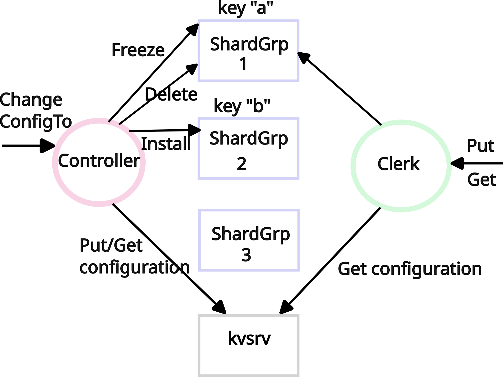

# shard

## 引言 (Introduction)

你可以选择基于自己的想法做最终项目，或者完成这个实验。

在这个实验中，你将构建一个键/值存储系统，该系统将键“分片 (shards)”或分区到一组使用 Raft 复制的键/值服务器组 (`shardgrps`) 上。一个分片是键/值对的一个子集；例如，所有以 "a" 开头的键可能属于一个分片，所有以 "b" 开头的键属于另一个分片，以此类推。分片的原因是为了性能。每个 `shardgrp` 仅处理少数几个分片的 `Put` 和 `Get` 请求，并且这些 `shardgrp` 是并行工作的；因此，系统的总吞吐量（单位时间内的 `Put` 和 `Get` 操作数）会随着 `shardgrp` 数量的增加而按比例增加。

### shardkv 设计



分片键/值服务包含上述组件（图中未显示，但在文本中描述）。

* **Shardgrps**（蓝色方块）：存储带有键的分片。例如 `shardgrp 1` 持有存储键 "a" 的分片，`shardgrp 2` 持有存储键 "b" 的分片。
* **客户端**（绿色圆圈）：通过 `Clerk` 与服务交互，`Clerk` 实现了 `Get` 和 `Put` 方法。为了找到传递给 `Put`/`Get` 的键对应的 `shardgrp`，`Clerk` 从 `kvsrv`（黑色方块，你在实验 2 中实现的）获取配置。配置描述了从分片到 `shardgrp` 的映射（例如，分片 1 由 `shardgrp 3` 提供服务）。

**管理员**（即测试者）使用另一个客户端——**控制器 (controller)**（紫色圆圈），向集群中添加/删除 `shardgrp` 并更新由哪个 `shardgrp` 服务哪个分片。控制器有一个主要方法：`ChangeConfigTo`，它接受一个新的配置作为参数，并将系统从当前配置更改为新配置；这涉及将分片移动到新加入系统的 `shardgrp`，以及将分片从离开系统的 `shardgrp` 中移出。为此，控制器 1) 向 `shardgrp` 发起 RPC（`FreezeShard`, `InstallShard`, 和 `DeleteShard`），2) 更新存储在 `kvsrv` 中的配置。

**需要控制器的原因**在于分片存储系统必须能够在 `shardgrp` 之间迁移分片。原因之一是某些 `shardgrp` 可能比其他的负载更重，因此需要移动分片以平衡负载。另一个原因是 `shardgrp` 可能会加入和离开系统：添加新的 `shardgrp` 以增加容量，或者现有的 `shardgrp` 因维修或退役而离线。

**本实验的主要挑战**在于：在处理 1) 分片到 `shardgrp` 的分配变化，以及 2) 从 `ChangeConfigTo` 期间发生故障或被分区的控制器中恢复的同时，确保 `Get`/`Put` 操作的线性一致性 (linearizability)。

`ChangeConfigTo` 将分片从一个 `shardgrp` 移动到另一个。风险在于某些客户端可能使用旧的 `shardgrp`，而其他客户端使用新的 `shardgrp`，这可能会破坏线性一致性。你需要确保在任何时候，对于每个分片，最多只有一个 `shardgrp` 在为请求提供服务。

如果 `ChangeConfigTo` 在重新配置期间失败，如果某些分片已经开始从一个 `shardgrp` 移动到另一个但尚未完成，这些分片可能无法访问。为了推进进度，测试者会启动一个新的控制器，你的工作是确保新的控制器能完成前一个控制器开始的重新配置工作。

本实验使用“**配置 (configuration)**”一词来指代分片到 `shardgrp` 的分配。这与 Raft 集群成员变更不同。你不需要实现 Raft 集群成员变更。

一个 `shardgrp` 服务器仅属于一个 `shardgrp`。给定 `shardgrp` 中的服务器集合永远不会改变。

客户端和服务器之间的交互**仅允许使用 RPC**。例如，不允许你的服务器不同实例之间共享 Go 变量或文件。

* **在 Part A 中**，你将实现一个可工作的 `shardctrler`，它将在 `kvsrv` 中存储和检索配置。你还将实现 `shardgrp`（使用你的 Raft `rsm` 包进行复制）以及相应的 `shardgrp` clerk。`shardctrler` 与 `shardgrp` clerk 通信以在不同组之间移动分片。
* **在 Part B 中**，你将修改你的 `shardctrler` 以处理配置更改期间的故障和分区。
* **在 Part C 中**，你将扩展你的 `shardctrler` 以允许并发控制器运行而不相互干扰。
* **最后，在 Part D 中**，你将有机会以你喜欢的方式扩展你的解决方案。

本实验的分片键/值服务遵循与 Flat Datacenter Storage, BigTable, Spanner, FAWN, Apache HBase, Rosebud, Spinnaker 等系统相同的通用设计。尽管这些系统在许多细节上与本实验不同，且通常更复杂和强大。例如，本实验不演变每个 Raft 组中的对等节点集合；其数据和查询模型很简单；等等。

**Lab 5 将使用你在 Lab 2 中的 `kvsrv`，以及你在 Lab 4 中的 `rsm` 和 `Raft`。** 你的 Lab 5 和 Lab 4 必须使用相同的 `rsm` 和 `Raft` 实现。

你可以为 Part A 使用晚交时间（late hours），但**不能**为 Part B-D 使用晚交时间。

## 入门指南 (Getting Started)

执行 `git pull` 以获取最新的实验软件。

我们在 `src/shardkv1` 中为你提供了测试和骨架代码：

* `client.go`：用于 shardkv clerk。
* `shardcfg` 包：用于计算分片配置。
* `shardgrp` 包：用于 `shardgrp` clerk 和 server。
* `shardctrler` 包：包含 `shardctrler.go`，其中有供控制器更改配置 (`ChangeConfigTo`) 和获取配置 (`Query`) 的方法。

要开始运行，执行以下命令：

```bash
$ cd ~/6.5840
$ git pull
...
$ cd src/shardkv1
$ go test -v
=== RUN  TestInitQuery5A
Test (5A): Init and Query ... (reliable network)...
    shardkv_test.go:46: Static wrong null 0
...
```

## Part A: 移动分片 (困难)

你的第一项工作是在没有故障的情况下实现 `shardgrp` 以及 `InitConfig`, `Query`, 和 `ChangeConfigTo` 方法。我们已经在 `shardkv1/shardcfg` 中为你提供了描述配置的代码。每个 `shardcfg.ShardConfig` 都有一个唯一的识别号、一个从分片编号到组编号的映射，以及一个从组编号到复制该组的服务器列表的映射。通常分片数量会多于组数量（以便每个组服务多个分片），这样可以在相当细的粒度上转移负载。

在 `shardctrler/shardctrler.go` 中实现以下两个方法：

1. **`InitConfig` 方法**：接收第一个配置（由测试者作为 `shardcfg.ShardConfig` 传递）。`InitConfig` 应将配置存储在 Lab 2 的 `kvsrv` 实例中。
2. **`Query` 方法**：返回当前配置；它应该从 `kvsrv` 读取配置（此前由 `InitConfig` 存储在那里的）。

实现 `InitConfig` 和 `Query`，将配置存储在 `kvsrv` 中。当你通过第一个测试时即完成此步。注意此任务不需要任何 `shardgrp`。

```bash
$ cd ~/6.5840/src/shardkv1
$ go test -run TestInitQuery5A                   
Test (5A): Init and Query ... (reliable network)...
  ... Passed --  time  0.0s #peers 1 #RPCs     3 #Ops    0
PASS
ok      6.5840/shardkv1 0.197s
```

* 通过在 `kvsrv` 中存储和读取初始配置来实现 `InitConfig` 和 `Query`：使用 `ShardCtrler.IKVClerk` 的 `Get`/`Put` 方法与 `kvsrv` 通信，使用 `ShardConfig` 的 `String` 方法将 `ShardConfig` 转换为可以传递给 `Put` 的字符串，并使用 `shardcfg.FromString()` 函数将字符串转换回 `ShardConfig`。
* 通过复制你的 Lab 4 `kvraft` 解决方案中的代码，在 `shardkv1/shardgrp/server.go` 中实现 `shardgrp` 的初始版本，并在 `shardkv1/shardgrp/client.go` 中实现相应的 clerk。
* 在 `shardkv1/client.go` 中实现一个 clerk，它使用 `Query` 方法找到键对应的 `shardgrp`，然后与该 `shardgrp` 通信。

当你通过 Static 测试时即完成此步。

```bash
$ cd ~/6.5840/src/shardkv1
$ go test -run Static
Test (5A): one shard group ... (reliable network)...
  ... Passed --  time  5.4s #peers 1 #RPCs   793 #Ops  180
PASS
ok      6.5840/shardkv1 5.632s
```

* 从你的 `kvraft` 的 `client.go` 和 `server.go` 复制 `Put` 和 `Get` 代码，以及其他需要的代码。
* `shardkv1/client.go` 中的代码为整个系统提供 `Put`/`Get` clerk：它通过调用 `Query` 方法找出哪个 `shardgrp` 持有所需键的分片，然后与持有该分片的 `shardgrp` 通信。
* 实现 `shardkv1/client.go`，包括其 `Put`/`Get` 方法。使用 `shardcfg.Key2Shard()` 查找键的分片编号。
* 测试者将一个 `ShardCtrler` 对象传递给 `shardkv1/client.go` 中的 `MakeClerk`。使用 `Query` 方法检索当前配置。
* 要从 `shardgrp` 进行 put/get 操作，`shardkv` clerk 应该通过调用 `shardgrp.MakeClerk` 为该 `shardgrp` 创建一个 clerk，传入配置中找到的服务器和 `shardkv` clerk 的 `ck.clnt`。
* 使用 `ShardConfig` 的 `GidServers()` 方法获取分片所属的组。
* `shardkv1/client.go` 的 `Put` 在回复可能丢失时必须返回 `ErrMaybe`，但此 `Put` 会调用 `shardgrp` 的 `Put` 与特定 `shardgrp` 通信。内部的 `Put` 可以通过错误信号告知这一点。
* 在创建时，第一个 `shardgrp` (`shardcfg.Gid1`) 应初始化为拥有所有分片。

现在你应该通过实现 `ChangeConfigTo` 方法来支持在组之间移动分片，该方法将旧配置更改为新配置。新配置可能包含旧配置中不存在的新 `shardgrp`，也可能排除旧配置中存在的 `shardgrp`。控制器应移动分片（键/值数据），以便每个 `shardgrp` 存储的分片集合与新配置相匹配。

我们建议的移动分片的方法是：`ChangeConfigTo` 首先在源 `shardgrp` 处“**冻结 (freeze)**”该分片，导致该 `shardgrp` 拒绝针对正在移动的分片中键的 `Put` 请求。然后，将分片**复制 (install)** 到目标 `shardgrp`；接着**删除 (delete)** 已冻结的分片。最后，发布新配置，以便客户端可以找到移动后的分片。这种方法的一个好处是它避免了 `shardgrp` 之间的任何直接交互。它还支持为不受正在进行的配置更改影响的分片提供服务。

为了能够对配置更改进行排序，每个配置都有一个唯一的编号 `Num`（见 `shardcfg/shardcfg.go`）。Part A 中的测试者按顺序调用 `ChangeConfigTo`，传递给 `ChangeConfigTo` 的配置的 `Num` 将比前一个大 1；因此，具有较高 `Num` 的配置比具有较低 `Num` 的更新。

网络可能会延迟 RPC，并且 RPC 可能会乱序到达 `shardgrp`。为了拒绝旧的 `FreezeShard`, `InstallShard`, 和 `DeleteShard` RPC，它们应该包含 `Num`（见 `shardgrp/shardrpc/shardrpc.go`），并且 `shardgrp` 必须记住它们为每个分片见过的最大 `Num`。

在 `shardctrler/shardctrler.go` 中实现 `ChangeConfigTo` 并扩展 `shardgrp` 以支持 freeze, install, 和 delete。`ChangeConfigTo` 在 Part A 中应总是成功，因为测试者在此部分不会引发故障。你需要使用 `shardgrp/shardrpc` 包中的 RPC 在 `shardgrp/client.go` 和 `shardgrp/server.go` 中实现 `FreezeShard`, `InstallShard`, 和 `DeleteShard`，并基于 `Num` 拒绝旧的 RPC。你还需要修改 `shardkv1/client.go` 中的 shardkv clerk 以处理 `ErrWrongGroup`，如果 `shardgrp` 不负责该分片，它应该返回此错误。

当你通过 `JoinBasic` 和 `DeleteBasic` 测试时，你就完成了此任务。这些测试侧重于添加 `shardgrp`；你暂时不必担心 `shardgrp` 离开。

* 对于不属于该 `shardgrp` 负责的键的 `Put`/`Get` 请求（即，该键的分片未分配给该 `shardgrp`），`shardgrp` 应回复 `ErrWrongGroup` 错误。
* 你必须修改 `shardkv1/client.go` 以重新读取配置并重试 `Put`/`Get`。
* 注意，你必须通过你的 `rsm` 包运行 `FreezeShard`, `InstallShard`, 和 `DeleteShard`，就像 `Put` 和 `Get` 一样。
* 你可以在 RPC 请求或回复中发送整个 map 作为状态，这可能有助于保持分片传输代码的简单。
* 如果你的某个 RPC 处理程序在回复中包含了一个 map（例如键/值 map），而该 map 是服务器状态的一部分，你可能会因竞争条件而遇到 Bug。RPC 系统必须读取 map 才能将其发送给调用者，但它并没有持有覆盖该 map 的锁。然而，你的服务器可能会在 RPC 系统读取 map 时继续修改同一个 map。解决方案是 RPC 处理程序在回复中包含该 map 的**副本**。
* 扩展 `ChangeConfigTo` 以处理**离开**的 shard groups；即，在当前配置中存在但在新配置中不存在的 `shardgrp`。你的解决方案现在应该通过 `TestJoinLeaveBasic5A`。（你可能在上一个任务中已经处理了此场景，但之前的测试没有测试 `shardgrp` 离开的情况。）

使你的解决方案通过所有 Part A 测试，这些测试检查你的分片键/值服务是否支持：多个组加入和离开、`shardgrp` 从快照重启、在某些分片离线或涉及配置更改时处理 `Get`、以及当许多客户端与服务交互同时测试者并发调用控制器的 `ChangeConfigTo` 重新平衡分片时的线性一致性。

```bash
$ cd ~/6.5840/src/shardkv1
$ go test -run 5A
... (省略具体测试输出，同原文)
PASS
ok      6.5840/shardkv1 243.115s
```

你的解决方案必须继续为不受正在进行的配置更改影响的分片提供服务。

## Part B: 处理控制器故障 (简单)

控制器是一个短暂的命令，由管理员调用：它移动分片然后退出。但是，它可能在移动分片时失败或失去网络连接。本部分实验的主要任务是从未能完成 `ChangeConfigTo` 的控制器中**恢复**。测试者在分区隔离第一个控制器后启动一个新的控制器并调用其 `ChangeConfigTo`；你必须修改控制器，以便新的控制器完成重新配置。测试者在启动控制器时调用 `InitController`；你可以修改该函数以检查是否需要完成被中断的配置更改。

允许控制器完成前一个控制器开始的重新配置的一个好方法是保留两个配置：一个**当前 (current)** 配置和一个**下一个 (next)** 配置，两者都存储在控制器的 `kvsrv` 中。当控制器开始重新配置时，它存储 `next` 配置。一旦控制器完成重新配置，它将 `next` 配置变为 `current` 配置。修改 `InitController`，首先检查是否存在存储的 `next` 配置且其配置编号高于 `current` 配置，如果存在，则完成重新配置到 `next` 配置所需的分片移动。

修改 `shardctrler` 以实现上述方法。接手失败控制器工作的控制器可能会重复 `FreezeShard`, `InstallShard`, 和 `Delete` RPC；`shardgrp` 可以使用 `Num` 检测重复并拒绝它们。如果你的解决方案通过 Part B 测试，则表示你已完成此任务。

```bash
$ cd ~/6.5840/src/shardkv1
$ go test -run 5B
...
PASS
ok      6.5840/shardkv1 35.805s
```

测试者在启动控制器时调用 `InitController`；你可以在 `shardctrler/shardctrler.go` 中的该方法里实现恢复逻辑。

## Part C: 并发配置更改 (中等)

在本部分实验中，你将修改控制器以允许并发控制器。当一个控制器崩溃或被分区时，测试者将启动一个新的控制器，它必须完成旧控制器可能正在进行的任何工作（即，像 Part B 那样完成移动分片）。这意味着可能会有多个控制器并发运行，并向 `shardgrp` 和存储配置的 `kvsrv` 发送 RPC。

主要挑战是确保这些控制器不会互相干扰。在 Part A 中，你已经用 `Num` 对所有 `shardgrp` RPC 进行了防护，以便拒绝旧的 RPC。即使几个控制器并发接手旧控制器的工作，其中一个成功，其他的重复所有 RPC，`shardgrp` 也会忽略它们。

因此剩下的挑战情况是确保**只有一个**控制器更新 `next` 配置，以避免两个控制器（例如，一个被分区的和一个新的）在 `next` 中放入不同的配置。为了对这种情况进行压力测试，测试者并发运行多个控制器，每个控制器通过读取当前配置并针对离开或加入的 `shardgrp` 进行更新来计算下一个配置，然后测试者调用 `ChangeConfigTo`；因此多个控制器可能会使用具有相同 `Num` 的不同配置调用 `ChangeConfigTo`。你可以使用键的版本号和带版本的 `Put` 来确保只有一个控制器更新 `next` 配置，而其他的调用则不做任何事情直接返回。

修改你的控制器，以便对于一个配置 `Num`，只有一个控制器可以发布 `next` 配置。测试者将启动许多控制器，但应该只有一个针对新配置启动 `ChangeConfigTo`。如果你通过 Part C 的并发测试，即完成了此任务。

```bash
$ cd ~/6.5840/src/shardkv1
$ go test -run TestConcurrentReliable5C
...
$ go test -run TestAcquireLockConcurrentUnreliable5C
...
```

*(参考 `test.go` 中的 `concurCtrler` 查看测试者如何并发运行控制器。)*

在这个练习中，你将把旧控制器的恢复与新控制器结合起来：新控制器应该执行 Part B 中的恢复。如果旧控制器在 `ChangeConfigTo` 期间被分区，你必须确保旧控制器不会干扰新控制器。如果控制器的所有更新都已经通过 Part B 中的 `Num` 检查进行了适当防护，你可能不需要编写额外代码。如果你通过 Partition 测试，即完成了此任务。

```bash
$ cd ~/6.5840/src/shardkv1
$ go test -run Partition
...
PASS
ok      6.5840/shardkv1 217.779s
```

恭喜！你已经完成了一个高可用的分片键/值服务，它具有多个分片组以实现可扩展性，通过重新配置来处理负载变化，并具有容错控制器。

**重新运行所有测试**以检查你最近对控制器的更改是否破坏了之前的测试。Gradescope 将在你的提交上重新运行 Lab 3A-D 和 Lab 4A-C 测试，以及 5C 测试。在提交之前，仔细检查你的解决方案是否有效：

```bash
go test ./raft1
go test ./kvraft1
go test ./shardkv1
```

## Part D: 扩展你的解决方案

在本实验的最后一部分，你可以以任何你喜欢的方式扩展你的解决方案。你必须为你选择实现的任何扩展编写自己的测试。

实现以下想法之一或提出你自己的想法。在文件 `extension.md` 中写一段话描述你的扩展，并将 `extension.md` 上传到 Gradescope。如果你想做一个更难的、开放式的扩展，可以随意与班上的另一位同学合作。

这里有一些可能的扩展想法（前几个很简单，后面的更开放）：

1. **(简单)** 更改测试者以使用 `kvraft` 而不是 `kvsrv`（即，将 `test.go` 中的 `MakeTestMaxRaft` 里的 `kvsrv.StartKVServer` 替换为 `kvraft.StartKVServer`），以便控制器使用你的 `kvraft` 来存储其配置。编写一个测试，检查当其中一个 `kvraft` 对等节点宕机时，控制器能否查询和更新配置。测试者的现有代码分布在 `src/kvtest1`, `src/shardkv1`, 和 `src/tester1` 中。
2. **(中等)** 更改 `kvsrv` 以实现像去年 Lab 2 中那样的 `Put`/`Get` **精确一次 (exactly-once)** 语义（参见丢弃消息部分）。你可能可以从 2024 年移植一些测试，而不必从头开始编写。在你的 `kvraft` 中也实现精确一次。
3. **(中等)** 更改 `kvsrv` 以支持 `Range` 函数，该函数返回低键到高键范围内的所有键。实现 `Range` 的懒惰方法是遍历服务器维护的键/值映射；更好的方法是使用支持范围搜索的数据结构（例如 B-tree）。包括一个在懒惰解决方案上失败但在更好解决方案上通过的测试。
4. **(困难)** 修改你的 `kvraft` 实现，允许 Leader **不通过 rsm 运行 Get** 就提供服务。即，实现 Raft 论文第 8 节末尾描述的优化，包括 Leases（租约），以确保 `kvraft` 保持线性一致性。你的实现应该通过现有的 `kvraft` 测试。你还应该添加一个测试检查你的优化实现是否更快（例如，通过比较 RPC 数量），以及一个测试检查任期切换是否更慢，因为新 Leader 必须等待租约过期。
5. **(困难)** 在 `kvraft` 中支持**事务 (transactions)**，以便开发人员可以原子地执行多个 `Put` 和 `Get`。一旦有了事务，你就不再需要带版本的 `Put`；事务包含带版本的 `Put`。参考 `etcd` 的事务作为一个示例接口。编写测试以证明你的扩展有效。
6. **(困难)** 修改 `shardkv` 以支持**事务**，以便开发人员可以跨分片原子地执行多个 `Put` 和 `Get`。这需要实现两阶段提交 (two-phase-commit) 和两阶段锁定 (two-phase locking)。编写测试以证明你的扩展有效。

## 提交程序 (Handin procedure)

在提交之前，请最后一次运行所有测试。
在提交之前，仔细检查你的解决方案是否可以通过以下测试：

```bash
go test ./raft1
go test ./kvraft1
go test ./shardkv1
```
