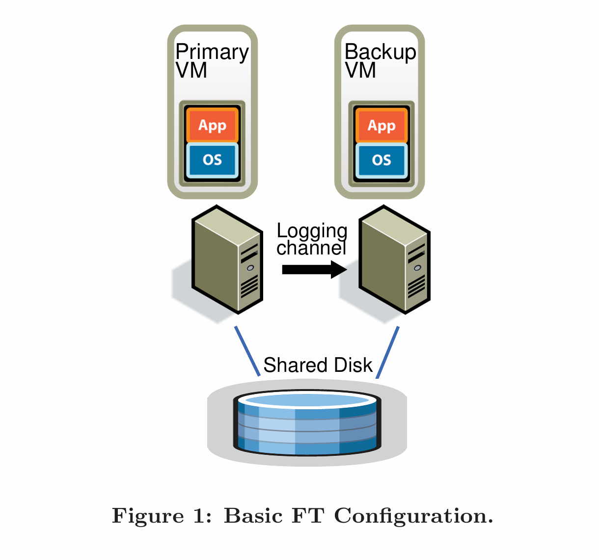
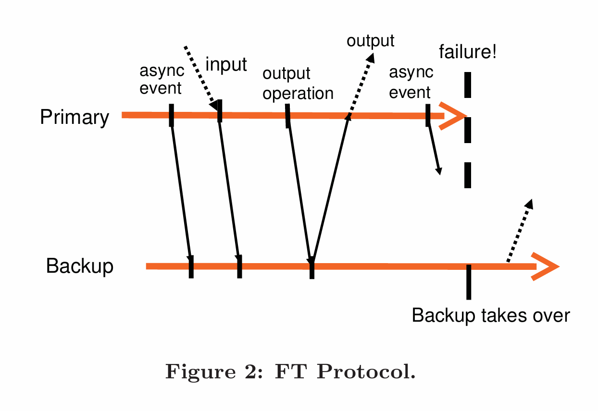
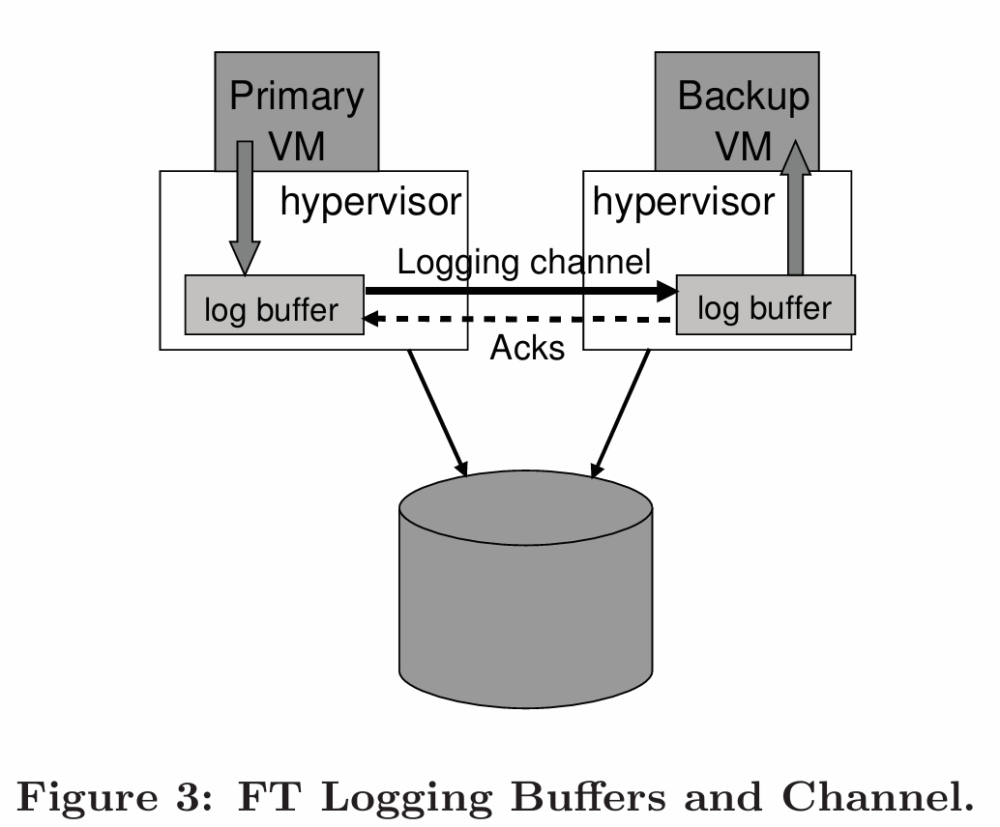
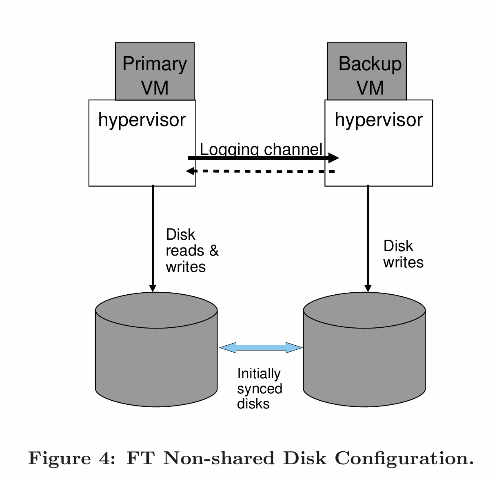

# The Design of a Practical System for Fault-Tolerant Virtual Machines

> [一种实用的容错虚拟机系统设计](https://pdos.csail.mit.edu/6.824/papers/vm-ft.pdf)

Daniel J. Scales, Mike Nelson, and Ganesh Venkitachalam

VMware, Inc

{scales,mnelson,ganesh}@vmware.com

## 摘要

我们实现了一套商业企业级的系统，用于提供具有容错能力的虚拟机，该系统基于通过另一台服务器上的备份虚拟机（Backup VM）来复制主虚拟机（Primary VM）执行过程的方法。我们在 VMware vSphere 4.0 中设计了一套完整的系统，它易于使用，运行在商用服务器上，并且通常将实际应用程序的性能损耗控制在 10% 以内。此外，对于几种实际应用程序而言，保持主虚拟机和辅助虚拟机步调一致（Lockstep）执行所需的数据带宽不到 20 Mbit/s，这使得在更长距离上实现容错成为了可能。一个易于使用、且在故障发生后能自动恢复冗余的商业系统，除了虚拟机执行的复制外，还需要许多额外的组件。我们设计并实现了这些额外的组件，并解决了在支持运行企业级应用程序的虚拟机时遇到的许多实际问题。在本文中，我们将描述我们的基本设计，讨论替代的设计选择以及许多实现细节，并提供微基准测试和实际应用程序的性能结果。

## 1. 引言 (INTRODUCTION)

实现容错服务器的一种常见方法是主/从（primary/backup）方法 [1]，即如果主服务器发生故障，备份服务器随时可用并进行接管。备份服务器的状态必须时刻保持与主服务器几乎完全一致，以便在主服务器发生故障时，备份服务器能够立即接管，并且接管过程对外部客户端是不可见的，且不会丢失数据。在备份服务器上复制状态的一种方法是，将主服务器所有状态（包括 CPU、内存和 I/O 设备）的变更几乎连续不断地传输给备份服务器。然而，发送这些状态——特别是内存中的变更——所需的带宽（bandwidth）可能会非常大。

另一种用于复制服务器且所需带宽少得多的方法，有时被称为状态机方法（state machine approach） [13]。其核心思想是将服务器建模为确定性状态机（deterministic state machines），通过从相同的初始状态启动它们，并确保它们以相同的顺序接收相同的输入请求，来保持它们的同步。由于大多数服务器或服务都有一些非确定性的操作，因此必须使用额外的协调机制来确保主服务器和备份服务器保持同步。但是，保持主从同步所需的额外信息量，远少于主服务器中正在发生变化的状态总量（主要是内存更新）。

要对物理服务器 [14] 实施协调以确保确定性执行是困难的，通过随着处理器频率的增加更是如此。相比之下，运行在管理程序（hypervisor）之上的虚拟机（VM）是实现状态机方法的绝佳平台。虚拟机可以被视为定义良好的状态机，其操作就是被虚拟化的机器（包括其所有设备）的操作。与物理服务器一样，虚拟机也有一些非确定性操作（例如读取日历时钟或中断的传递），因此必须向备份服务器发送额外信息以确保其保持同步。由于管理程序完全控制着虚拟机的执行（包括所有输入的传递），因此管理程序能够捕获主虚拟机上关于非确定性操作的所有必要信息，并在备份虚拟机上正确地重放（replay）这些操作。

因此，状态机方法可以在商用硬件（commodity hardware）上的虚拟机中实现，无需任何硬件修改，从而允许在最新的微处理器上立即实现容错。此外，状态机方法所需的低带宽使得主服务器和备份服务器在物理上相隔更远成为可能。例如，复制的虚拟机可以运行在分布于整个园区（campus）的物理机器上，这比运行在同一栋大楼内的虚拟机提供了更高的可靠性。

我们在 VMware vSphere 4.0 平台上使用主/从方法实现了容错虚拟机，该平台能以高效的方式运行完全虚拟化的 x86 虚拟机。由于 VMware vSphere 实现了完整的 x86 虚拟机，我们能够自动为任何 x86 操作系统和应用程序提供容错能力。允许我们记录主虚拟机的执行并确保备份虚拟机执行完全相同的操作的基础技术被称为确定性重放（deterministic replay） [15]。VMware vSphere Fault Tolerance (FT) 基于确定性重放，但添加了构建完整容错系统所需的必要额外协议和功能。除了提供硬件容错外，我们的系统还能在故障发生后，通过在本地集群中的任何可用服务器上启动新的备份虚拟机，来自动恢复冗余。目前，确定性重放和 VMware FT 的生产版本仅支持单处理器（uni-processor）虚拟机。记录和重放多处理器（multi-processor）虚拟机的执行仍然是一项正在进行的工作（work in progress），由于几乎每次对共享内存的访问都可能是一个非确定性操作，这面临着显著的性能问题。

Bressoud 和 Schneider [3] 描述了在 HP PA-RISC 平台上容错虚拟机的原型实现。我们的方法与之类似，但为了性能原因我们做出了一些根本性的改变，并研究了许多设计替代方案。此外，我们不得不设计并实现系统中的许多额外组件，并处理许多实际问题，以构建一个高效且可供运行企业级应用程序的客户使用的完整系统。与讨论的大多数其他实用系统类似，我们只尝试处理故障停止（fail-stop）故障 [12]，即那些在发生故障的服务器导致不正确的外部可见行为之前就能被检测到的服务器故障。

本文的其余部分组织如下。首先，我们将描述我们的基本设计，并详细介绍我们的基本协议，这些协议确保了如果主虚拟机发生故障后备份虚拟机接管时不会丢失数据。然后，我们详细描述为了构建一个健壮、完整且自动化的系统必须解决的许多实际问题。我们还描述了实现容错虚拟机时出现的几个设计选择，并讨论了这些选择中的权衡（tradeoffs）。接下来，我们将给出我们的实现针对某些基准测试和某些实际企业应用程序的性能结果。最后，我们描述相关工作并进行总结。

## 2. 基本设计 (Basic Design)

图 1 展示了我们容错虚拟机系统的基本设置。对于一个给定的、我们需要提供容错能力的虚拟机（即主虚拟机 / Primary VM），我们在另一台不同的物理服务器上运行一个备份虚拟机 (Backup VM)，该备份虚拟机保持与主虚拟机同步并执行完全相同的操作，尽管会有微小的时间滞后。我们称这两个虚拟机处于虚拟步调一致 (virtual lockstep) 状态。虚拟机的虚拟磁盘位于共享存储 (shared storage)（例如光纤通道 Fibre Channel 或 iSCSI 磁盘阵列）上，因此主虚拟机和备份虚拟机都可以对其进行输入和输出访问。（我们将会在 4.1 节讨论一种主备虚拟机拥有独立且非共享虚拟磁盘的设计。）只有主虚拟机在网络上宣示 (advertise) 其存在，因此所有的网络输入都只进入主虚拟机。同样地，所有其他的输入（如键盘和鼠标）也只进入主虚拟机。

主虚拟机接收到的所有输入都会通过一个被称为日志通道 (logging channel) 的网络连接发送给备份虚拟机。对于服务器工作负载而言，主要的输入流量是网络和磁盘。正如在下文 2.1 节中所讨论的，为了确保备份虚拟机以与主虚拟机相同的方式执行非确定性操作 (non-deterministic operations)，我们会根据需要传输额外的信息。结果就是备份虚拟机的执行总是与主虚拟机完全相同。然而，备份虚拟机的输出 (outputs) 会被管理程序（Hypervisor）丢弃 (dropped)，因此只有主虚拟机会产生返回给客户端的实际输出。正如 2.2 节所述，主虚拟机和备份虚拟机遵循一个特定的协议，其中包括来自备份虚拟机的显式确认 (explicit acknowledgments)，以确保如果主虚拟机发生故障，不会丢失任何数据。

为了检测主虚拟机或备份虚拟机是否发生故障，我们的系统结合使用了相关服务器之间的心跳检测 (heartbeating) 和对日志通道流量的监控。此外，我们必须确保只有主虚拟机或备份虚拟机中的一个接管执行权，即使是在主备服务器失去彼此通信的脑裂 (split-brain) 情况下也是如此。

在接下来的章节中，我们将提供几个重要领域的更多细节。在 2.1 节中，我们给出了确定性重放 (deterministic replay) 技术的一些细节，该技术通过日志通道发送的信息确保主备虚拟机保持同步。在 2.2 节中，我们描述了我们 FT 协议的一条基本规则 (fundamental rule)，该规则确保在主虚拟机发生故障时不会丢失数据。在 2.3 节中，我们描述了我们以正确方式检测和响应故障的方法。

### 2.1 确定性重放的实现 (Deterministic Replay Implementation)

正如我们之前提到的，复制服务器（或虚拟机）的执行可以被建模为确定性状态机的复制。如果两个确定性状态机从相同的初始状态开始，并且以相同的顺序接收完全相同的输入，那么它们将经历相同的状态序列并产生相同的输出。虚拟机拥有一组广泛的输入，包括传入的网络数据包、磁盘读取以及来自键盘和鼠标的输入。非确定性事件（Non-deterministic events，例如虚拟中断）和非确定性操作（Non-deterministic operations，例如读取处理器的时钟周期计数器）也会影响虚拟机的状态。这为复制运行任何操作系统和工作负载的任何虚拟机的执行带来了三个挑战：（1）正确捕获所有必要的输入和非确定性信息，以确保备份虚拟机的确定性执行；（2）正确地将这些输入和非确定性信息应用到备份虚拟机上；（3）以不降低性能的方式完成上述工作。此外，x86 微处理器中的许多复杂指令具有未定义的、因此也是非确定性的副作用（side effects）。捕获这些未定义的副作用并重放它们以产生相同的状态，是一个额外的挑战。

VMware 确定性重放 [15] 正是为 VMware vSphere 平台上的 x86 虚拟机提供了这种功能。确定性重放将虚拟机的输入以及所有与虚拟机执行相关的可能的非确定性信息，记录在一个写入日志文件的日志条目流中。稍后可以通过读取该文件中的日志条目来精确地重放虚拟机的执行。对于非确定性操作，系统会记录足够的信息，以便该操作能够以相同的状态变化和输出来复现。对于像定时器或 IO 完成中断这样的非确定性事件，事件发生的确切指令（exact instruction）也会被记录下来。在重放期间，该事件会在指令流的同一点被传递。VMware 确定性重放实现了一种高效的事件记录和事件传递机制，该机制采用了多种技术，包括使用与 AMD [2] 和 Intel [8] 联合开发的硬件性能计数器（hardware performance counters）。

Bressoud 和 Schneider [3] 提到将虚拟机的执行划分为纪元（epochs），其中像中断这样的非确定性事件仅在纪元结束时才被传递。“纪元”的概念似乎被用作一种批处理机制，因为在中断发生的确切指令处单独传递每个中断的代价过于昂贵。然而，我们的事件传递机制足够高效，以至于 VMware 确定性重放无需使用纪元。每一个中断都会在它发生时被记录，并在重放时于适当的指令处被高效地传递。

### 2.2 FT 协议 (FT Protocol)

对于 VMware FT，我们使用确定性重放来生成必要的日志条目以记录主虚拟机（Primary VM）的执行过程，但我们并不将日志条目写入磁盘，而是通过日志通道（logging channel）将其发送给备份虚拟机（Backup VM）。备份虚拟机实时重放这些条目，因此执行过程与主虚拟机完全一致。然而，为了确保实现容错，我们必须在日志条目之上，在日志通道中增加严格的 FT 协议。我们的基本要求如下：

输出要求（Output Requirement）：如果备份虚拟机在主虚拟机发生故障后接管，备份虚拟机必须以一种与主虚拟机已发送给外部世界的所有输出完全一致的方式继续执行。

需要注意的是，在故障切换（failover）发生后（即主虚拟机发生故障，备份虚拟机接管后），由于执行过程中发生了许多非确定性事件，备份虚拟机的执行方式很可能会开始与主虚拟机原本可能继续执行的方式截然不同。然而，只要备份虚拟机满足输出要求，在故障切换到备份虚拟机的过程中就没有外部可见的状态或数据丢失，客户端也不会察觉到服务的中断或不一致。

可以通过推迟任何外部输出（通常是网络数据包），直到备份虚拟机接收到允许其至少重放执行到该输出操作点所需的所有信息，来确保满足输出要求。一个必要的条件是，备份虚拟机必须已经接收到了在该输出操作之前生成的所有日志条目。这些日志条目将允许它执行到最后一条日志条目所在点。然而，假设故障恰好发生在主虚拟机执行了输出操作之后。备份虚拟机必须知道它必须继续重放到该输出操作的点，并且仅在该点才“上线”（即停止重放并作为主虚拟机接管，如 2.3 节所述）。如果备份虚拟机在输出操作之前的最后一条日志条目处就上线，某些非确定性事件（例如传递给虚拟机的定时器中断）可能会在它执行输出操作之前改变其执行路径（从而导致输出不一致）。

鉴于上述约束，强制执行输出要求的最简单方法是在每次输出操作时创建一个特殊的日志条目。然后，可以通过以下特定规则来强制执行输出要求：

输出规则（Output Rule）：主虚拟机不得向外部世界发送输出，直到备份虚拟机收到并确认（acknowledged）了与产生该输出的操作相关联的日志条目。

如果备份虚拟机接收到了所有日志条目，包括产生输出的操作的日志条目，那么备份虚拟机将能够精确地复现主虚拟机在该输出点的状态，因此如果主虚拟机死亡，备份虚拟机将正确地达到与该输出一致的状态。反之，如果备份虚拟机在没有收到所有必要日志条目时就接管，那么它的状态可能会迅速分叉（diverge），导致与主虚拟机的输出不一致。输出规则在某些方面类似于文献 [11] 中描述的方法，即“外部同步”IO 实际上可以被缓冲，只要它在下一次外部通信之前被实际写入磁盘即可。

请注意，输出规则并没有说要停止主虚拟机的执行。我们只需要推迟发送输出，但虚拟机本身可以继续执行。由于操作系统使用异步中断来执行非阻塞的网络和磁盘输出以指示完成，虚拟机可以轻松地继续执行，而不一定会立即受到输出延迟的影响。相比之下，之前的工作 [3, 9] 通常指出，在进行输出之前，主虚拟机必须完全停止，直到备份虚拟机确认了来自主虚拟机的所有必要信息。

作为一个例子，我们在图 2 中展示了一个说明 FT 协议要求的图表。该图显示了主虚拟机和备份虚拟机上的事件时间线。从主虚拟机线指向备份虚拟机线的箭头代表日志条目的传输，从备份虚拟机线指向主虚拟机线的箭头代表确认（acknowledgments）。关于异步事件、输入和输出操作的信息必须作为日志条目发送给备份虚拟机并得到确认。如图所示，向外部世界的输出被推迟，直到主虚拟机收到来自备份虚拟机的确认，表明它已收到与该输出操作相关联的日志条目。只要遵循输出规则，备份虚拟机就能够在与主虚拟机最后一次输出一致的状态下接管。

在故障切换的情况下，我们无法保证所有输出都精确地产生一次（exactly once）。如果在主虚拟机打算发送输出时没有使用带有两阶段提交的事务，备份虚拟机就无法确定主虚拟机是在发送最后一次输出之前还是之后崩溃的。幸运的是，网络基础设施（包括普遍使用的 TCP）被设计为能够处理丢失的数据包和相同的（重复的）数据包。需要注意的是，进入主虚拟机的数据包也可能在主虚拟机故障期间丢失，因此不会传递给备份虚拟机。然而，由于与服务器故障无关的任何原因都可能导致传入数据包被丢弃，因此网络基础设施、操作系统和应用程序在编写时都确保了它们能够补偿丢失的数据包。

### 2.3 检测与响应故障 (Detecting and Responding to Failure)

如上所述，如果另一台虚拟机似乎发生了故障，主虚拟机和备份虚拟机必须迅速做出响应。如果备份虚拟机发生故障，主虚拟机将转为独立运行（go live）——即退出记录模式（从而停止在日志通道上发送条目）并开始正常执行。如果主虚拟机发生故障，备份虚拟机也应类似地转为独立运行，但这个过程要稍微复杂一些。由于执行上的滞后，备份虚拟机很可能拥有许多已接收并确认、但尚未被消耗（consumed）的日志条目，因为备份虚拟机尚未执行到相应的点。备份虚拟机必须继续从日志条目中重放其执行过程，直到它消耗完最后一条日志条目。在那一刻，备份虚拟机将停止重放模式，并开始作为一台普通虚拟机执行。本质上，备份虚拟机已被晋升（promoted）为主虚拟机（且现在缺少一个备份虚拟机）。

由于它不再是备份虚拟机，新的主虚拟机在客户操作系统（Guest OS）执行输出操作时，现在将向外部世界产生输出。在过渡到正常模式期间，可能需要一些特定于设备的操作，以允许这种输出正确发生。特别是，为了联网的目的，VMware FT 会自动在网络上广播（advertises）新主虚拟机的 MAC 地址，以便物理网络交换机知道新主虚拟机位于哪台服务器上。此外，新晋升的主虚拟机可能需要重新发出一些磁盘 IO（如 3.4 节所述）。

有许多可能的方法来尝试检测主虚拟机和备份虚拟机的故障。VMware FT 使用运行容错虚拟机的服务器之间的 UDP 心跳（UDP heartbeating）来检测服务器何时可能已崩溃。此外，VMware FT 监控从主虚拟机发送到备份虚拟机的日志流量，以及从备份虚拟机发送到主虚拟机的确认信息。由于定期的定时器中断，对于一个正常运行的客户操作系统而言，日志流量应该是规律的且永不停止。因此，日志条目流或确认信息的停滞（halt）可能表明虚拟机发生了故障。如果心跳或日志流量停止的时间超过了特定的超时时间（timeout）（通常是几秒钟的数量级），则宣告发生故障。

然而，任何此类故障检测方法都容易受到脑裂（split-brain）问题的影响。如果备份服务器停止收到来自主服务器的心跳，这可能表明主服务器已发生故障，也可能仅仅意味着仍在正常运行的服务器之间的所有网络连接都已丢失。如果备份虚拟机随后转为独立运行，而主虚拟机实际上仍在运行，这就可能导致数据损坏以及与该虚拟机通信的客户端出现问题。因此，我们必须确保当检测到故障时，主虚拟机或备份虚拟机中只有一个能转为独立运行。为了避免脑裂问题，我们利用存储虚拟机虚拟磁盘的共享存储（shared storage）。当主虚拟机或备份虚拟机想要转为独立运行（go live）时，它会在共享存储上执行一个原子测试并设置（atomic test-and-set）操作。如果该操作成功，该虚拟机就被允许转为独立运行。如果该操作失败，说明另一个虚拟机肯定已经转为独立运行了，因此当前的虚拟机实际上会自行停止（即“自杀 / commits suicide”）。如果虚拟机在尝试执行原子操作时无法访问共享存储，那么它只能等待直到可以访问为止。需要注意的是，如果是由于存储网络中的某些故障导致共享存储无法访问，那么该虚拟机无论如何也无法进行有用的工作，因为虚拟磁盘就驻留在同一个共享存储上。因此，使用共享存储来解决脑裂情况不会引入任何额外的不可用性。

设计中的最后一个方面是，一旦发生故障且其中一台虚拟机已转为独立运行，VMware FT 会通过在另一台主机上启动一个新的备份虚拟机来自动恢复冗余（restores redundancy）。虽然这一过程在大多数先前的工作中未被涵盖，但它对于使容错虚拟机具有实用价值是至关重要的，并且需要精心的设计。更多细节将在 3.1 节中给出。

## 3. FT 的实际实现 (PRACTICAL IMPLEMENTATION OF FT)

第 2 节描述了我们 FT 的基本设计和协议。然而，为了创建一个可用、健壮且自动化的系统，还有许多其他组件必须被设计和实现。

### 3.1 启动和重启 FT 虚拟机 (Starting and Restarting FT VMs)

必须设计的最大的额外组件之一是启动备份虚拟机并使其处于与主虚拟机相同状态的机制。当发生故障后重新启动（re-starting）备份虚拟机时，也将使用此机制。因此，该机制必须适用于处于任意状态（arbitrary state）（即不仅仅是刚启动时）的正在运行的主虚拟机。此外，我们希望该机制不会显著中断主虚拟机的执行，因为这会影响虚拟机的任何当前客户端。

对于 VMware FT，我们改编了 VMware vSphere 现有的 VMotion 功能。VMware VMotion [10] 允许将正在运行的虚拟机从一台服务器迁移（migration）到另一台服务器，且中断极小——虚拟机暂停时间通常不到一秒。我们创建了一种 VMotion 的修改版，它会在远程服务器上创建虚拟机的一个精确的运行副本（running copy），但不会销毁本地服务器上的虚拟机。也就是说，我们修改后的 FT VMotion 是将虚拟机克隆（clones）到远程主机，而不是迁移它。FT VMotion 还会建立日志通道，并使源虚拟机作为主虚拟机（primary）进入日志记录模式，使目标虚拟机作为新的备份虚拟机（backup）进入重放模式。像普通 VMotion 一样，FT VMotion 对主虚拟机执行的中断通常也不到一秒。因此，在正在运行的虚拟机上启用 FT 是一项简单的、非破坏性的操作。

启动备份虚拟机的另一个方面是选择在哪个服务器上运行它。容错虚拟机运行在有权访问共享存储（shared storage）的服务器集群（cluster）中，因此所有虚拟机通常都可以在集群中的任何服务器上运行。这种灵活性使得 VMware vSphere 即使在一个或多个服务器发生故障时也能恢复 FT 冗余。VMware vSphere 实现了一个集群服务（clustering service），用于维护管理和资源信息。

当故障发生且主虚拟机现在需要一个新的备份虚拟机来重建冗余（re-establish redundancy）时，主虚拟机会通知集群服务它需要一个新的备份。集群服务根据资源使用情况和其他约束条件，确定运行备份虚拟机的最佳服务器，并调用 FT VMotion 来创建新的备份虚拟机。结果是，VMware FT 通常可以在服务器发生故障后的几分钟内重建虚拟机冗余，而这一切对于容错虚拟机的执行没有任何明显的干扰。

### 3.2 管理日志通道 (Managing the Logging Channel)

在管理日志通道上的流量方面，有许多有趣的实现细节。在我们的实现中，管理程序（Hypervisors）为特定主虚拟机和备份虚拟机的日志条目维护了一个大型缓冲区（large buffer）。随着主虚拟机的执行，它将日志条目生成到日志缓冲区中；同样地，备份虚拟机从其日志缓冲区中消耗日志条目。主虚拟机日志缓冲区的内容会尽快被刷新（flushed out）到日志通道中，而日志条目一到达，就会从日志通道被读入备份虚拟机的日志缓冲区。备份虚拟机每次从网络将一些日志条目读入其日志缓冲区时，都会向主虚拟机发送确认（acknowledgments）。这些确认允许 VMware FT 确定何时可以发送被“输出规则（Output Rule）”所推迟的输出。图 3 说明了这一过程。

如果备份虚拟机在需要读取下一个日志条目时遇到空的日志缓冲区，它将停止执行，直到有新的日志条目可用。由于备份虚拟机不与外部通信，这种暂停不会影响虚拟机的任何客户端。同样地，如果主虚拟机在需要写入日志条目时遇到已满的日志缓冲区，它必须停止执行，直到日志条目可以被刷新出去。这种执行的停止是一种自然的流量控制机制（natural flow-control mechanism），当主虚拟机生成日志条目的速率过快时，它会使主虚拟机慢下来。然而，这种暂停会影响虚拟机的客户端，因为主虚拟机将完全停止且无响应，直到它能记录其条目并继续执行。因此，我们的实现必须经过设计，以最大程度地减少主虚拟机日志缓冲区被填满的可能性。

主虚拟机日志缓冲区可能被填满的一个原因是备份虚拟机执行得太慢，从而消耗日志条目太慢。一般来说，备份虚拟机重放执行的速度必须与主虚拟机记录执行的速度大致相同。幸运的是，在 VMware 确定性重放中，记录和重放的开销大致相同。然而，如果托管备份虚拟机的服务器承载了其他虚拟机从而负载很重（因此资源超配 / overcommitted on resources），尽管备份管理程序的 VM 调度器尽了最大努力，备份虚拟机可能仍无法获得足够的 CPU 和内存资源来像主虚拟机那样快地执行。

除了避免因日志缓冲区满而导致的意外暂停外，我们不希望执行滞后（execution lag）变得太大的另一个原因是：如果主虚拟机发生故障，备份虚拟机在转为独立运行（go live）并开始与外部世界通信之前，必须通过重放它已经确认的所有日志条目来“追赶”。完成重放的时间基本上就是故障发生时的执行滞后时间，因此备份虚拟机转为独立运行所需的时间大致等于故障检测时间加上当前的执行滞后时间。因此，我们不希望执行滞后时间很大（比如超过一秒），因为那会显著增加故障切换（failover）所需的时间。

因此，我们有一个额外的机制来使主虚拟机慢下来，以防止备份虚拟机落后太多。在我们要发送和确认日志条目的协议中，我们会发送额外的信息来确定主虚拟机和备份虚拟机之间的实时执行滞后。通常，执行滞后小于 100 毫秒。如果备份虚拟机开始出现显著的执行滞后（比如，超过 1 秒），VMware FT 就会开始通过通知调度器分配给主虚拟机稍微少一点的 CPU（最初只少几个百分点）来使主虚拟机慢下来。我们使用一个慢速反馈循环（slow feedback loop），试图逐渐精准定位到主虚拟机合适的 CPU 限制值，该值将允许备份虚拟机匹配其执行速度。如果备份虚拟机继续落后，我们会继续逐渐降低主虚拟机的 CPU 限制。反之，如果备份虚拟机追赶上来了，我们会逐渐增加主虚拟机的 CPU 限制，直到备份虚拟机恢复到保持微小的滞后。

需要注意的是，这种对主虚拟机的减速是非常罕见的，通常只有在系统处于极端压力（extreme stress）下才会发生。第 5 节中的所有性能数据都包含了任何此类减速带来的成本。

### 3.3 FT 虚拟机的操作 (Operation on FT VMs)

另一个实际问题是如何处理可能应用于主虚拟机的各种控制操作（control operations）。例如，如果主虚拟机被显式断电（explicitly powered off），备份虚拟机也应当停止，而不是尝试转为独立运行（go live）。再比如，主虚拟机上的任何资源管理变更（例如增加 CPU 份额）也应该应用于备份虚拟机。对于这类操作，特殊的控制条目（control entries）会通过日志通道从主虚拟机发送给备份虚拟机，以便在备份虚拟机上生效相应的操作。

通常，对虚拟机的大多数操作都应该仅在主虚拟机上发起。然后，VMware FT 发送任何必要的控制条目，以在备份虚拟机上引起相应的变化。唯一可以在主虚拟机和备份虚拟机上独立进行的操作是 VMotion。也就是说，主虚拟机和备份虚拟机可以独立地被 VMotion 到其他主机上。需要注意的是，VMware FT 会确保两个虚拟机不会被移动到同一台服务器上，因为那种情况将不再提供容错能力（单点故障）。

主虚拟机的 VMotion 比正常的 VMotion 增加了一些复杂性，因为备份虚拟机必须断开与源主虚拟机的连接，并在适当的时间重新连接到目标主虚拟机。

备份虚拟机的 VMotion 也有类似的问题，但增加了额外的复杂性。对于正常的 VMotion，我们要求在 VMotion 发生最终切换（final switchover）的那一刻，所有的未决磁盘 IO（outstanding disk IOs）必须被静默（quiesced，即完成）。对于主虚拟机，这种静默很容易处理：只需等待物理 IO 完成，并将这些完成信号传递给虚拟机即可。然而，对于备份虚拟机，没有简单的方法可以让所有 IO 在任何要求的点完成，因为备份虚拟机必须重放主虚拟机的执行，并在相同的执行点完成 IO。主虚拟机可能运行着一种在正常执行期间总是有磁盘 IO 在传输（in flight）的工作负载。

VMware FT 有一种独特的方法来解决这个问题。当备份虚拟机处于 VMotion 的最终切换点时，它通过日志通道请求主虚拟机暂时静默其所有的 IO。当备份虚拟机重放主虚拟机执行的静默操作时，备份虚拟机的 IO 自然也会在一个单一的执行点被静默。

### 3.4 磁盘 IO 的实现问题 (Implementation Issues for Disk IOs)

关于磁盘 IO，有许多微妙的实现问题。首先，考虑到磁盘操作是非阻塞（non-blocking）的，因此可以并行执行，访问同一磁盘位置的同时发生的磁盘操作可能会导致非确定性（non-determinism）。此外，我们的磁盘 IO 实现直接使用 DMA（Direct Memory Access） 进出虚拟机的内存，因此访问同一内存页面的同时发生的磁盘操作也可能导致非确定性。我们的解决方案通常是检测任何此类 IO 竞争（IO races）（这种情况很少见），并强制此类存在竞争的磁盘操作在主虚拟机和备份虚拟机上以相同的方式顺序执行（execute sequentially）。

其次，磁盘操作还可能与虚拟机中应用程序（或操作系统）的内存访问（memory access）发生竞争，因为磁盘操作通过 DMA 直接访问虚拟机的内存。例如，如果虚拟机中的应用程序/操作系统正在读取某个内存块，而此时磁盘读取操作也正在向该块写入数据，就可能产生非确定性的结果。这种情况虽然也不太可能发生，但如果发生了，我们必须检测并处理它。

一种解决方案是临时对作为磁盘操作目标的页面设置页面保护（page protection）。如果虚拟机碰巧访问了一个也是未决磁盘操作目标的页面，页面保护会导致陷入（trap），虚拟机可以被暂停直到磁盘操作完成。因为更改页面上的 MMU 保护是一项昂贵（耗时）的操作，我们选择使用反弹缓冲区（bounce buffers）。反弹缓冲区是一个临时缓冲区，其大小与磁盘操作访问的内存大小相同。

* 对于磁盘读取操作：我们将其修改为将指定数据读入反弹缓冲区，只有当 IO 完成信号被传递时，数据才会被复制到客户机内存（Guest Memory）中。
* 对于磁盘写入操作：要发送的数据首先被复制到反弹缓冲区，然后磁盘写入被修改为从反弹缓冲区写入数据。

使用反弹缓冲区可能会降低磁盘操作的速度，但我们在反弹缓冲区上没有观察到任何明显的性能损失。

第三，当发生故障且备份虚拟机接管时，主虚拟机上未决（outstanding，即未完成）的磁盘 IO 存在一些问题。新晋升的主虚拟机（原备份机）无法确定这些磁盘 IO 是已经发送到了磁盘，还是已经成功完成了。此外，由于这些磁盘 IO 并没有在备份虚拟机上向外部（物理磁盘）发出，因此随着新晋升的主虚拟机继续运行，这些 IO 将不会有显式的 IO 完成信号，这最终会导致虚拟机中的客户操作系统启动中止或重置程序（因为它一直在等结果却等不到）。

我们可以发送一个错误完成信号来表明每个 IO 都失败了，因为即使 IO 成功完成，返回一个错误通常也是可以接受的（OS 会重试）。然而，客户操作系统可能无法很好地应对来自其本地磁盘的错误。相反，我们在备份虚拟机转为独立运行（go live）的过程中重新发出（re-issue）这些挂起的 IO。因为我们已经消除了所有的竞争，并且所有 IO 都直接指定了访问哪些内存和磁盘块，所以即使这些磁盘操作已经成功完成过，重新发出它们也是安全的（即它们是幂等的 / idempotent）。

### 3.5 网络 IO 的实现问题

VMware vSphere 为虚拟机网络提供了许多性能优化。其中一些优化是基于管理程序异步更新（asynchronously updating）虚拟机网络设备的状态。例如，接收缓冲区可以在虚拟机执行的同时由管理程序直接更新。不幸的是，这些对虚拟机状态的异步更新增加了非确定性（non-determinism）。除非我们能保证所有的更新在主虚拟机和备份虚拟机的指令流中的同一点发生，否则备份虚拟机的执行可能会与主虚拟机发生分叉。

对于 FT 而言，网络模拟代码最大的变化就是禁用了异步网络优化。那些异步更新虚拟机环形缓冲区（ring buffers）以处理传入数据包的代码已被修改，强制客户机陷入（trap）到管理程序中，管理程序在这里记录这些更新，然后将它们应用到虚拟机上。同样地，通常异步地将数据包从发送队列中取出的代码在 FT 中也被禁用了，取而代之的是，发送操作通过陷入到管理程序来完成（除非如下文所述）。

消除网络设备的异步更新，加上 2.2 节所述的推迟发送数据包，给网络性能带来了一些挑战。我们在运行 FT 时采取了两种方法来提高虚拟机网络性能。
首先，我们实现了集群优化（clustering optimizations）以减少虚拟机的陷阱和中断。当虚拟机以足够的比特率流式传输数据时，管理程序可以对一组数据包仅执行一次发送陷阱，在最佳情况下甚至是零次陷阱，因为它可以作为接收新数据包的一部分来发送数据包。同样地，管理程序可以通过仅为一组数据包发布一个中断，来减少传入数据包对虚拟机的中断次数。

我们针对网络的第二个性能优化涉及减少已发送数据包的延迟。如前所述，管理程序必须推迟所有已发送的数据包，直到它从备份虚拟机收到相应日志条目的确认。减少发送延迟的关键是减少向备份虚拟机发送日志消息并获得确认所需的时间。我们在这一领域的主要优化涉及确保发送和接收日志条目及确认都可以在没有任何线程上下文切换（thread context switch）的情况下完成。VMware vSphere 管理程序允许向 TCP 栈注册函数，每当接收到 TCP 数据时，这些函数将从延迟执行上下文（deferred-execution context）（类似于 Linux 中的 tasklet）中被调用。

这允许我们在没有任何线程上下文切换的情况下，快速处理备份虚拟机上任何传入的日志消息以及主虚拟机接收到的任何确认。此外，当主虚拟机将一个要发送的数据包入队时，我们会通过调度一个延迟执行上下文来执行刷新，从而强制立即刷新（immediate log flush）相关的输出日志条目（如 2.2 节所述）。

## 4. 设计替代方案 (DESIGN ALTERNATIVES)

在 VMware FT 的实现中，我们探索了许多有趣的设计替代方案。在本节中，我们将探讨其中的一些。

### 4.1 共享磁盘 vs. 非共享磁盘

在我们的默认设计中，主虚拟机和备份虚拟机共享同一个虚拟磁盘。因此，如果发生故障切换，共享磁盘的内容自然是正确的且可用的。本质上，共享磁盘被视为主虚拟机和备份虚拟机的外部设备，所以对共享磁盘的任何写入都被视为对外部世界的通信。因此，只有主虚拟机对磁盘进行实际写入，并且根据输出规则（Output Rule），对共享磁盘的写入必须被推迟（直到备份机确认）。

另一种设计是主虚拟机和备份虚拟机拥有独立的（非共享的）虚拟磁盘。在这种设计中，备份虚拟机确实会对它自己的虚拟磁盘执行所有的磁盘写入操作。通过这样做，它自然地保持其虚拟磁盘的内容与主虚拟机的虚拟磁盘内容同步。图 4 展示了这种配置。在非共享磁盘的情况下，虚拟磁盘本质上被视为每个虚拟机内部状态（internal state）的一部分。因此，主虚拟机的磁盘写入不必根据输出规则进行推迟。

非共享设计在主备虚拟机无法访问共享存储的情况下非常有用。这可能是因为共享存储不可用或太昂贵，或者是因为运行主备虚拟机的服务器相距甚远（“长距离 FT / long-distance FT”）。非共享设计的一个缺点是，当首次启用容错时，两份虚拟磁盘副本必须以某种方式显式地同步（synced up）。此外，故障发生后磁盘可能会不同步，因此当备份虚拟机在故障后重启时，必须显式地重新同步（resynced）。也就是说，FT VMotion 不仅要同步主备虚拟机的运行状态，还要同步它们的磁盘状态。

在非共享磁盘配置中，可能没有共享存储可用于处理脑裂（split-brain）情况。在这种情况下，系统可以使用其他外部仲裁者（tiebreaker），例如两台服务器都能与之对话的第三方服务器。如果服务器是包含两个以上节点的集群的一部分，系统也可以使用基于集群成员资格的多数派算法（majority algorithm）。在这种情况下，只有当虚拟机运行在包含原始节点大多数（majority）的通信子集群中的服务器上时，才允许该虚拟机转为独立运行。

### 4.2 在备份虚拟机上执行磁盘读取

在我们的默认设计中，备份虚拟机从不从其虚拟磁盘读取数据（无论是共享还是非共享）。由于磁盘读取被视为一种输入（input），因此很自然地通过日志通道将磁盘读取的结果发送给备份虚拟机。

另一种设计是让备份虚拟机执行磁盘读取，从而消除磁盘读取数据的日志记录。对于那些进行大量磁盘读取的工作负载，这种方法可以极大地减少日志通道上的流量。

然而，这种方法有许多微妙之处。它可能会降低备份虚拟机的执行速度，因为备份虚拟机必须执行所有磁盘读取；如果当它执行到主虚拟机完成读取的同一点时，物理读取尚未完成，它就必须等待。

此外，必须做一些额外的工作来处理失败的磁盘读取操作。如果主虚拟机的磁盘读取成功了，但备份虚拟机对应的磁盘读取失败了，那么备份虚拟机的磁盘读取必须重试（retried）直到成功，因为备份虚拟机必须获得与主虚拟机内存中相同的数据。反之，如果主虚拟机的磁盘读取失败了，那么目标内存的内容必须通过日志通道发送给备份虚拟机，因为此时内存内容是不确定的，且备份虚拟机即使读取成功也未必能复现该内容。

最后，如果这种“备份机读取”的替代方案与“共享磁盘”配置一起使用，还有一个微妙之处。如果主虚拟机对特定磁盘位置进行读取，紧接着很快又对同一磁盘位置进行写入，那么磁盘写入必须推迟，直到备份虚拟机执行完第一次磁盘读取。这种依赖关系可以被检测并正确处理，但会增加实现的复杂性。

在 5.1 节中，我们给出了一些性能结果，表明在备份虚拟机上执行磁盘读取可能会导致实际应用程序的吞吐量略有下降（1-4%），但也显著减少了日志带宽。因此，在日志通道带宽非常有限的情况下，在备份虚拟机上执行磁盘读取可能是有用的。

### 5. 性能评估 (PERFORMANCE EVALUATION)

在本节中，我们对 VMware FT 在多种应用程序工作负载和网络基准测试下的性能进行了基本评估。对于这些结果，我们在完全相同的服务器上运行主虚拟机和备份虚拟机，每台服务器配备 8 个 Intel Xeon 2.8 Ghz CPU 和 8 GB 内存。服务器通过 10 Gbit/s 的交叉网络（crossover network）连接，尽管正如在所有案例中将看到的那样，实际使用的网络带宽远小于 1 Gbit/s。两台服务器都通过标准的 4 Gbit/s 光纤通道（Fibre Channel）网络连接到 EMC Clariion 存储来访问其共享虚拟磁盘。用于驱动某些工作负载的客户端通过 1 Gbit/s 网络连接到服务器。

我们在性能结果中评估的应用程序如下：

* SPECJbb2005：一个行业标准的 Java 应用程序基准测试，它是非常CPU 和内存密集型（CPU- and memory-intensive）的，几乎没有 IO 操作。
* Kernel Compile（内核编译）：运行 Linux 内核编译的工作负载。该工作负载进行一些磁盘读写，并且由于创建和销毁许多编译进程，它是非常 CPU 和 MMU（内存管理单元）密集型的。
* Oracle Swingbench：一个由 Swingbench OLTP（在线事务处理）工作负载驱动 Oracle 11g 数据库的工作负载。该工作负载进行大量的磁盘和网络 IO，并拥有 80 个并发数据库会话。
* MS-SQL DVD Store：一个由 DVD Store 基准测试驱动 Microsoft SQL Server 2005 数据库的工作负载，拥有 16 个并发客户端。

### 5.1 基本性能结果 (Basic Performance Results)

| 应用程序负载 | 性能比率 (FT / Non-FT) | 平均日志带宽 |
| --- | --- | --- |
| SPECJbb2005 | 0.98 | 1.5 Mbits/sec |
| Kernel Compile (内核编译) | 0.95 | 3.0 Mbits/sec |
| Oracle Swingbench | 0.99 | 12 Mbits/sec |
| MS-SQL DVD Store | 0.94 | 18 Mbits/sec |

表 1：基本性能结果

表 1 给出了基本性能结果。对于列出的每个应用程序，第二列给出了在运行服务器工作负载的虚拟机上启用 FT 时的性能与在同一虚拟机上未启用 FT 时的性能之比。性能比率的计算方式是：小于 1 的值表示 FT 工作负载较慢。显然，在这些代表性工作负载上启用 FT 的开销小于 10%。

* SPECJbb2005 是完全计算密集型的，没有空闲时间，但表现良好，因为它除了定时器中断外几乎没有非确定性事件。
* 其他工作负载进行磁盘 IO 并有一些空闲时间，因此部分 FT 开销可能会被 FT 虚拟机拥有较少空闲时间这一事实所掩盖（hidden）。

然而，总体的结论是：VMware FT 能够以相当低的性能开销支持容错虚拟机。

在表的第三列中，我们给出了运行这些应用程序时日志通道上发送数据的平均带宽。对于这些应用程序，日志带宽是非常合理的，且很容易被 1 Gbit/s 网络满足。实际上，低带宽需求表明，多个 FT 工作负载可以共享同一个 1 Gbit/s 网络，而不会产生任何负面的性能影响。

对于运行像 Linux 和 Windows 这样常见客户操作系统的虚拟机，我们发现当客户操作系统空闲时，典型的日志带宽为 0.5-1.5 Mbits/sec。“空闲”带宽主要是记录定时器中断传递的结果。对于具有活跃工作负载的虚拟机，日志带宽由必须发送给备份虚拟机的网络和磁盘输入主导——即接收到的网络数据包和从磁盘读取的磁盘块。因此，对于那些具有非常高网络接收或磁盘读取带宽的应用程序，日志带宽可能会比表 1 中测量的要高得多。对于这类应用程序，日志通道的带宽可能会成为瓶颈，特别是如果日志通道还有其他用途的话。

对于许多实际应用程序而言，日志通道所需的相对较低的带宽使得基于重放的容错对于使用非共享磁盘的长距离配置（long-distance configuration）非常有吸引力。对于主备机可能相隔 1-100 公里的长距离配置，光纤可以轻松支持 100-1000 Mbit/s 的带宽，延迟小于 10 毫秒。对于表 1 中的应用程序，100-1000 Mbit/s 的带宽对于获得良好的性能应该是足够的。然而请注意，主备机之间额外的往返延迟（round-trip latency）可能会导致网络和磁盘输出被推迟多达 20 毫秒。长距离配置仅适用于其客户端能够容忍每次请求增加这种额外延迟的应用程序。

对于两个磁盘密集程度最高的应用程序，我们测量了在备份虚拟机上执行磁盘读取（如 4.2 节所述）与通过日志通道发送磁盘读取数据的性能影响对比。

* 对于 Oracle Swingbench，在备份虚拟机上执行磁盘读取时，吞吐量降低了约 4%；
* 对于 MS-SQL DVD Store，吞吐量降低了约 1%。
* 与此同时，日志带宽显著下降：Oracle Swingbench 从 12 Mbits/sec 降至 3 Mbits/sec，MS-SQL DVD Store 从 18 Mbits/sec 降至 8 Mbits/sec。

显然，对于具有更大磁盘读取带宽的应用程序，带宽节省可能会更大。正如 4.2 节所述，预计当磁盘读取在备份虚拟机上执行时，性能可能会略差一些。然而，对于日志通道带宽受限的情况（例如长距离配置），在备份虚拟机上执行磁盘读取可能是有用的。

### 5.2 网络基准测试

由于多种原因，网络基准测试对我们的系统来说相当具有挑战性：

1. 高速网络可能会有非常高的中断率（interrupt rate），这要求以非常高的速率记录和重放异步事件。
2. 以高速率接收数据包的基准测试会导致高速率的日志流量，因为所有此类数据包必须通过日志通道发送给备份虚拟机。
3. 发送数据包的基准测试将受到输出规则（Output Rule）的约束，该规则将推迟网络数据包的发送，直到收到来自备份虚拟机的相应确认为止。这种延迟会增加测量到的客户端延迟。这种延迟也可能降低到客户端的网络带宽，因为网络协议（如 TCP）可能会受到限制。

| 网络基准测试模式 | 基础带宽 (Non-FT) | FT 带宽 (Client Visible) | 日志带宽 (Primary -> Backup) |
| --- | --- | --- | --- |
| Receive (1Gb) | 940 | 604 | 730 |
| Transmit (1Gb) | 940 | 855 | 42 |
| Receive (10Gb) | 940 | 860 | 990 |
| Transmit (10Gb) | 940 | 935 | 60 |

表 2：网络性能基准测试

表 2 给出了使用标准 netperf 基准测试进行的一系列测量的结果。在所有这些测量中，客户端虚拟机和主虚拟机通过 1 Gbit/s 网络连接。

* 前两行给出了主备主机通过 1 Gbit/s 日志通道连接时的发送和接收性能。
* 第三和第四行给出了主备服务器通过 10 Gbit/s 日志通道连接时的发送和接收性能，该通道不仅具有更高的带宽，而且具有比 1 Gbit/s 网络更低的延迟。作为粗略的衡量标准，1 Gbit/s 连接的管理程序之间的 ping 时间约为 150 微秒，而 10 Gbit/s 连接的 ping 时间约为 90 微秒。

当未启用 FT 时，主虚拟机可以达到接近 1 Gbit/s 线速（940 Mbit/s）的发送和接收速度。

* 接收工作负载：当启用 FT 时，日志带宽非常大，因为所有传入的网络数据包都必须在日志通道上发送。因此，日志通道可能会成为瓶颈，如 1 Gbit/s 日志网络的结果所示。对于 10 Gbit/s 日志网络，这种影响要小得多。
* 发送工作负载：当启用 FT 时，发送数据包的数据不被记录，但网络中断仍必须被记录。日志带宽要低得多，因此可实现的网络发送带宽高于网络接收带宽。

总体而言，我们看到 FT 在非常高的发送和接收速率下会显著限制网络带宽，但仍然可以实现较高的绝对速率。

## 6. 相关工作 (RELATED WORK)

Bressoud 和 Schneider [3] 描述了通过完全包含在管理程序级别的软件来实现虚拟机容错的最初想法。他们通过一个针对配备 HP PA-RISC 处理器的服务器的原型，证明了保持备份虚拟机与主虚拟机同步的可行性。然而，由于 PA-RISC 架构的限制，他们无法实现完全安全、隔离的虚拟机。此外，他们没有实现任何故障检测方法，也没有尝试解决第 3 节中描述的任何实际问题。更重要的是，他们对自己的 FT 协议施加了许多不必要的约束。首先，他们强加了“纪元（epochs）”的概念，即异步事件被推迟到设定的间隔结束时才处理。“纪元”的概念是不必要的——他们强加这一概念可能是因为他们无法足够高效地重放单个异步事件。其次，他们要求主虚拟机必须完全停止执行，直到备份虚拟机接收并确认了所有先前的日志条目。然而，实际上只有输出本身（例如网络数据包）必须被推迟，主虚拟机本身是可以继续执行的。

Bressoud [4] 描述了一种在操作系统（Unixware）中实现容错的系统，从而为在该操作系统上运行的所有应用程序提供容错能力。系统调用接口成为了必须被确定性复制的操作集合。这项工作与基于管理程序的工作具有类似的局限性和设计选择。

Napper 等人 [9] 以及 Friedman 和 Kama [7] 描述了容错 Java 虚拟机的实现。他们在通过日志通道发送关于输入和非确定性操作的信息方面，采用了与我们类似的设计。像 Bressoud 一样，他们似乎并没有专注于故障检测以及故障发生后的容错重建。此外，他们的实现仅限于为运行在 Java 虚拟机中的应用程序提供容错。这些系统试图处理多线程 Java 应用程序的问题，但要求所有数据都通过锁正确保护，或者强制对共享内存的访问进行序列化。

Dunlap 等人 [6] 描述了一种针对半虚拟化（paravirtualized）系统上调试应用软件的确定性重放实现。我们的工作支持在虚拟机内部运行任意操作系统，并为这些虚拟机实现容错支持，这要求更高水平的稳定性和性能。

Cully 等人 [5] 描述了另一种支持容错虚拟机的方法及其在一个名为 Remus 的项目中的实现。在这种方法中，主虚拟机的状态在执行期间被重复地进行检查点（checkpointed）操作，并发送到收集检查点信息的备份服务器。检查点必须执行得非常频繁（每秒多次），因为外部输出必须被推迟，直到随后的检查点被发送并确认。这种方法的优点是它同样适用于单处理器和多处理器虚拟机。主要问题是，这种方法对网络带宽有极高的要求，以便在每个检查点发送内存状态的增量变更。在 [5] 中展示的 Remus 结果显示，当尝试使用 1 Gbit/s 网络连接传输内存状态变更来执行每秒 40 次检查点时，内核编译和 SPECweb 基准测试的速度减慢了 100% 到 225%。虽然有一些优化可能有助于减少所需的网络带宽，但尚不清楚在 1 Gbit/s 连接下能否实现合理的性能。相比之下，我们基于确定性重放的方法可以实现低于 10% 的开销，并且对于几种实际应用程序，主备主机之间所需的带宽不到 20 Mbit/s。

## 7. 结论与未来工作 (CONCLUSION AND FUTURE WORK)

我们在 VMware vSphere 中设计并实现了一个高效且完整的系统，为运行在集群服务器上的虚拟机提供容错（FT）能力。我们的设计基于使用 VMware 确定性重放，通过另一台主机上的备份虚拟机来复制主虚拟机的执行。如果运行主虚拟机的服务器发生故障，备份虚拟机将立即接管，且没有中断或数据丢失。

总体而言，VMware FT 在商用硬件上的容错虚拟机性能非常出色，对于一些典型应用程序显示的开销低于 10%。VMware FT 的大部分性能成本来自于使用 VMware 确定性重放来保持主备虚拟机同步的开销。因此，VMware FT 的低开销源于 VMware 确定性重放的高效率。此外，保持主备同步所需的日志带宽通常非常小，往往低于 20 Mbit/s。由于在大多数情况下日志带宽非常小，因此实现主备虚拟机相隔长距离（1-100 公里）的配置似乎是可行的。因此，VMware FT 可以用于那些同时也需要防范整个站点故障（disasters）的场景。值得注意的是，日志流通常具有很高的可压缩性，简单的压缩技术可以通过少量的额外 CPU 开销显著降低日志带宽。

我们在 VMware FT 上的结果表明，基于确定性重放可以构建高效的容错虚拟机实现。这样的系统可以透明地为运行任何操作系统和应用程序的虚拟机提供容错能力，且开销极小。然而，为了使容错虚拟机系统对客户有用，它还必须是健壮的、易于使用的且高度自动化的。一个可用的系统除了虚拟机的复制执行外，还需要许多其他组件。特别是，VMware FT 通过在本地集群中寻找合适的服务器并在该服务器上创建新的备份虚拟机，从而在故障发生后自动恢复冗余。通过解决所有必要的问题，我们已经展示了一个可用于客户数据中心内实际应用程序的系统。

通过确定性重放实现容错的权衡之一是，目前的确定性重放仅针对单处理器虚拟机进行了高效实现。然而，单处理器虚拟机对于各种各样的工作负载来说已经绰绰有余，特别是考虑到物理处理器正变得越来越强大。此外，许多工作负载可以通过使用许多单处理器虚拟机进行横向扩展（scaled out），而不是通过使用一个更大的多处理器虚拟机进行纵向扩展（scaling up）。针对多处理器虚拟机的高性能重放是一个活跃的研究领域，并且可能通过微处理器中的某些额外硬件支持来实现。一个有趣的方向可能是扩展事务内存模型以促进多处理器重放。

在未来，我们也有些兴趣去扩展我们的系统以处理部分硬件故障（partial hardware failure）。所谓部分硬件故障，我们指的是服务器中并未导致数据损坏或丢失的功能或冗余的各种部分丧失。一个例子是虚拟机的所有网络连接丢失，或者物理服务器中冗余电源的丢失。如果在运行主虚拟机的服务器上发生部分硬件故障，在许多情况下（但并非所有情况）立即故障切换到备份虚拟机将是有利的。这样的故障切换可以立即恢复关键虚拟机的全面服务，并确保虚拟机迅速从潜在不可靠的服务器上移走。

## 致谢 (Acknowledgments)

我们要感谢 Krishna Raja，他生成了许多性能结果。有许多人参与了 VMware FT 的实现。确定性重放（包括对各种虚拟设备的支持）以及基础 FT 功能的核心实现者包括 Lan Huang, Eric Lowe, Slava Malyugin, Alex Mirgorodskiy, Kaustubh Patil, Boris Weissman, Petr Vandrovec, 和 Min Xu。此外，还有许多其他人参与了 VMware vCenter 中 FT 的高层管理工作。Karyn Ritter 在管理大部分工作中做得非常出色。

## 8. 参考文献 (REFERENCES)

[1] Alsberg, P., and Day, J.
A Principle for Resilient Sharing of Distributed Resources. (分布式资源弹性共享原则)
*In Proceedings of the Second International Conference on Software Engineering (1976), pp. 627–644.*
(收录于 1976 年第二届国际软件工程会议论文集)

[2] AMD Corporation.
AMD64 Architecture Programmer’s Manual. (AMD64 架构程序员手册)
*Sunnyvale, CA.*

[3] Bressoud, T., and Schneider, F.
Hypervisor-based Fault Tolerance. (基于管理程序的容错)
*In Proceedings of SOSP 15 (Dec. 1995).*
(收录于 1995 年 12 月第 15 届操作系统原理研讨会 SOSP 论文集)

[4] Bressoud, T. C.
TFT: A Software System for Application-Transparent Fault Tolerance. (TFT：一种应用透明的容错软件系统)
*In Proceedings of the Twenty-Eighth Annual International Symposium on Fault-Tolerance Computing (June 1998), pp. 128–137.*
(收录于 1998 年 6 月第 28 届年度国际容错计算研讨会论文集)

[5] Cully, B., Lefebvre, G., Meyer, D., Feeley, M., Hutchison, N., and Warfield, A.
Remus: High Availability via Asynchronous Virtual Machine Replication. (Remus：通过异步虚拟机复制实现高可用性)
*In Proceedings of the Fifth USENIX Symposium on Networked Systems Design and Implementation (Apr. 2008), pp. 161–174.*
(收录于 2008 年 4 月第五届 USENIX 网络系统设计与实现研讨会 NSDI 论文集)

[6] Dunlap, G. W., King, S. T., Cinar, S., Basrai, M., and Chen, P. M.
ReVirt: Enabling Intrusion Analysis through Virtual Machine Logging and Replay. (ReVirt：通过虚拟机日志记录和重放实现入侵分析)
*In Proceedings of the 2002 Symposium on Operating Systems Design and Implementation (Dec. 2002).*
(收录于 2002 年 12 月操作系统设计与实现研讨会 OSDI 论文集)

[7] Friedman, R., and Kama, A.
Transparent Fault-Tolerant Java Virtual Machine. (透明的容错 Java 虚拟机)
*In Proceedings of Reliable Distributed System (Oct. 2003), pp. 319–328.*
(收录于 2003 年 10 月可靠分布式系统会议论文集)

[8] Intel Corporation.
Intel® 64 and IA-32 Architectures Software Developer’s Manuals. (Intel® 64 和 IA-32 架构软件开发人员手册)
*Santa Clara, CA.*

[9] Napper, J., Alvisi, L., and Vin, H.
A Fault-Tolerant Java Virtual Machine. (一种容错 Java 虚拟机)
*In Proceedings of the International Conference on Dependable Systems and Networks (June 2002), pp. 425–434.*
(收录于 2002 年 6 月国际可靠系统与网络会议 DSN 论文集)

[10] Nelson, M., Lim, B.-H., and Hutchins, G.
Fast Transparent Migration for Virtual Machines. (虚拟机的快速透明迁移)
*In Proceedings of the 2005 Annual USENIX Technical Conference (Apr. 2005).*
(收录于 2005 年 4 月 USENIX 年度技术会议论文集)

[11] Nightingale, E. B., Veeraraghavan, K., Chen, P. M., and Flinn, J.
Rethink the Sync. (重新思考同步)
*In Proceedings of the 2006 Symposium on Operating Systems Design and Implementation (Nov. 2006).*
(收录于 2006 年 11 月操作系统设计与实现研讨会 OSDI 论文集)

[12] Schlicting, R., and Schneider, F. B.
Fail-stop Processors: An Approach to Designing Fault-tolerant Computing Systems. (故障停止处理器：一种设计容错计算系统的方法)
*ACM Computing Surveys 1,3 (Aug. 1983), 222–238.*
(发布于 1983 年 8 月 ACM 计算调查期刊)

[13] Schneider, F. B.
Implementing fault-tolerance services using the state machine approach: A tutorial. (使用状态机方法实现容错服务：教程)
*ACM Computing Surveys 22, 4 (Dec. 1990), 299–319.*
(发布于 1990 年 12 月 ACM 计算调查期刊)

[14] Stratus Technologies.
Benefit from Stratus Continuing Processing Technology: Automatic 99.999% Uptime for Microsoft Windows Server Environments. (受益于 Stratus 持续处理技术：为 Microsoft Windows Server 环境提供自动化的 99.999% 正常运行时间)
*Whitepaper, June 2009.*
(2009 年 6 月发布的白皮书)

[15] Xu, M., Malyugin, V., Sheldon, J., Venkitachalam, G., and Weissman, B.
ReTrace: Collecting Execution Traces with Virtual Machine Deterministic Replay. (ReTrace：使用虚拟机确定性重放收集执行踪迹)
*In Proceedings of the 2007 Workshop on Modeling, Benchmarking, and Simulation (June 2007).*
(收录于 2007 年 6 月建模、基准测试与模拟研讨会论文集)
