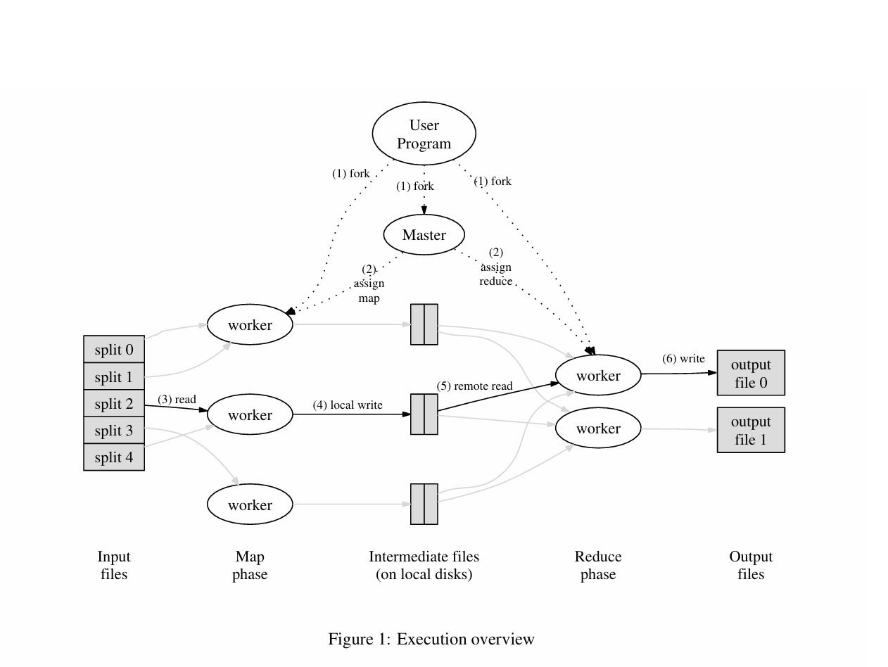
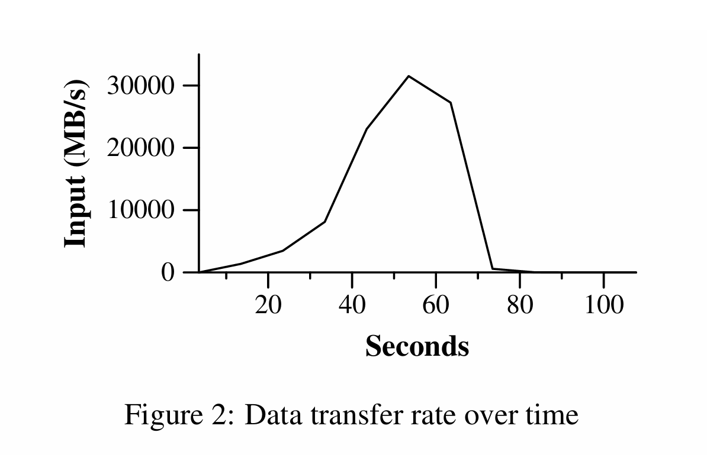
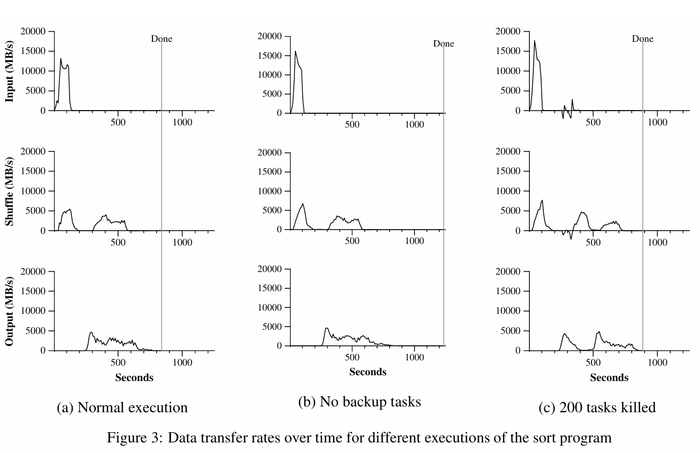
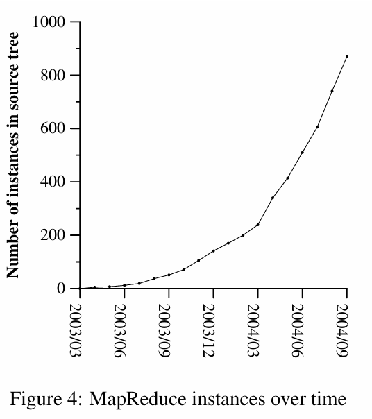

# MapReduce: Simplified Data Processing on Large Clusters

> [MapReduce：大型集群上的简化数据处理](https://pdos.csail.mit.edu/6.824/papers/mapreduce.pdf)

**Jeffrey Dean 和 Sanjay Ghemawat**
[jeff@google.com](mailto:jeff@google.com), [sanjay@google.com](mailto:sanjay@google.com)
Google, Inc.

## 摘要

MapReduce 是一个编程模型及其相关实现，用于处理和生成海量数据集。用户指定一个 **map（映射）** 函数来处理一个键/值对（key/value pair），从而生成一组中间键/值对；同时指定一个 **reduce（归约）** 函数，用来合并所有具有相同中间键的中间值。正如论文所示，许多现实世界的任务都可以用这种模型来表达。

以这种函数式风格编写的程序，会自动在由大量商用机器（commodity machines）组成的集群上进行并行化和执行。运行时系统（run-time system）负责处理输入数据的划分、跨机器的程序执行调度、机器故障的处理以及管理所需的机器间通信等细节。这使得没有任何并行或分布式系统经验的程序员也能轻松利用大型分布式系统的资源。

我们的 MapReduce 实现运行在大型商用机器集群上，并且具有高度的可扩展性：一次典型的 MapReduce 计算可以在数千台机器上处理数 TB 的数据。程序员发现该系统易于使用：目前已有数百个 MapReduce 程序被实现，且每天在 Google 的集群上执行的 MapReduce 作业已超过一千个。

## 1. 介绍 (Introduction)

在过去的五年里，作者和 Google 的许多其他人实现了数百种专用计算，用于处理海量的原始数据，例如爬取的文档、Web 请求日志等，以计算各种类型的衍生数据，例如倒排索引、Web 文档图结构的各种表示、每个主机爬取的页面数量摘要、给定日期内最频繁的查询集合等。大多数此类计算在概念上都是直截了当的。然而，输入数据通常非常巨大，计算必须分布在数百或数千台机器上，以便在合理的时间内完成。如何并行化计算、分发数据以及处理故障的问题交织在一起，用大量处理这些问题的复杂代码掩盖了原本简单的计算逻辑。

为了应对这种复杂性，我们设计了一种新的抽象，它允许我们表达我们要执行的简单计算，但将并行化、容错、数据分发和负载均衡的繁杂细节隐藏在一个库中。我们的抽象灵感来自于 Lisp 和许多其他函数式语言中的 map 和 reduce 原语。我们意识到，我们的大多数计算都涉及对输入中的每个逻辑“记录”应用 **map** 操作，以计算一组中间键/值对（key/value pairs），然后对所有共享相同键的值应用 **reduce** 操作，以适当地合并衍生数据。我们使用这种带有用户指定的 map 和 reduce 操作的函数式模型，使我们能够轻松地并行化大型计算，并使用重新执行（re-execution）作为容错的主要机制。

这项工作的主要贡献是一个简单而强大的接口，它能够实现大规模计算的自动并行化和分发，并结合了该接口的一个在大型商用 PC 集群上实现高性能的实现版本。

第 2 节描述了基本的编程模型并给出了几个示例。第 3 节描述了针对我们基于集群的计算环境量身定制的 MapReduce 接口实现。第 4 节描述了我们发现有用的对编程模型的几项改进。第 5 节包含了我们的实现对各种任务的性能测量。第 6 节探讨了 MapReduce 在 Google 内部的使用，包括我们将其用作重写生产索引系统基础的经验。第 7 节讨论了相关工作和未来工作。

## 2. 编程模型 (Programming Model)

该计算接受一组**输入键/值对**（input key/value pairs），并产生一组**输出键/值对**（output key/value pairs）。MapReduce 库的用户将计算表达为两个函数：**Map** 和 **Reduce**。

**Map** 函数由用户编写，它接受一个输入对，并产生一组**中间键/值对**（intermediate key/value pairs）。MapReduce 库将所有与同一个中间键 $ I $ 相关联的中间值聚合在一起，并将它们传递给 **Reduce** 函数。

**Reduce** 函数也由用户编写，它接受一个中间键 $ I $ 以及该键的一组值。它将这些值合并在一起，从而形成一个可能更小的值的集合。通常，每次 Reduce 调用只产生零个或一个输出值。中间值通过一个迭代器提供给用户的 reduce 函数。这使我们要能够处理因太大而无法放入内存的值列表。

### 2.1 示例 (Example)

考虑在一个大型文档集合中统计每个单词出现次数的问题。用户将编写类似于以下伪代码的代码：

```cpp
map(String key, String value):
// key: document name (文档名称)
// value: document contents (文档内容)
for each word w in value:
    EmitIntermediate(w, "1");

reduce(String key, Iterator values):
// key: a word (一个单词)
// values: a list of counts (计数列表)
int result = 0;
for each v in values:
    result += ParseInt(v);
Emit(AsString(result));
```

Map 函数输出每个单词以及一个相关的出现次数计数（在这个简单的例子中仅仅是“1”）。Reduce 函数将针对特定单词输出的所有计数进行求和。

此外，用户编写代码以填充一个 mapreduce 规范对象（specification object），其中包含输入和输出文件的名称以及可选的调优参数。然后用户调用 MapReduce 函数，将该规范对象传递给它。用户的代码与 MapReduce 库（用 C++ 实现）链接在一起。附录 A 包含了该示例的完整程序文本。

### 2.2 类型 (Types)

尽管前面的伪代码是用字符串输入和输出来编写的，但在概念上，用户提供的 map 和 reduce 函数具有关联的类型：

$$
\begin{array}{ll}
\text{map} (k_1, v_1) & \rightarrow \text{list}(k_2, v_2) \\
\text{reduce} (k_2, \text{list}(v_2)) & \rightarrow \text{list}(v_2)
\end{array}
$$

也就是说，输入键和值来自与输出键和值不同的域（domain）。此外，中间键和值与输出键和值来自相同的域。

我们的 C++ 实现向用户定义的函数传递字符串并从中接收字符串，留给用户代码去在字符串和适当的类型之间进行转换。

### 2.3 更多示例 (More Examples)

这里有几个有趣的程序的简单示例，它们可以很容易地表示为 MapReduce 计算。

**分布式 Grep (Distributed Grep)：** Map 函数如果匹配提供的模式（pattern），就输出该行。Reduce 函数是一个恒等函数（identity function），它只是将提供的中间数据复制到输出。

**URL 访问频率计数 (Count of URL Access Frequency)：** Map 函数处理网页请求日志并输出 $ \langle \text{URL}, 1 \rangle $。Reduce 函数将相同 URL 的所有值相加，并输出一个 $ \langle \text{URL}, \text{total count} \rangle $ 对。

**反向 Web 链接图 (Reverse Web-Link Graph)：** Map 函数为每个在名为 source 的页面中找到的指向 target URL 的链接输出 $ \langle \text{target}, \text{source} \rangle $ 对。Reduce 函数拼接与给定 target URL 相关联的所有 source URL 的列表，并输出对：$ \langle \text{target}, \text{list}(\text{source}) \rangle $。

**每个主机的术语向量 (Term-Vector per Host)：** 术语向量将出现在一个文档或一组文档中的最重要的单词总结为一个 $ \langle \text{word}, \text{frequency} \rangle $ 对的列表。Map 函数为每个输入文档输出一个 $ \langle \text{hostname}, \text{term vector} \rangle $ 对（其中 hostname 是从文档的 URL 中提取的）。Reduce 函数接收给定主机的所有每文档术语向量（per-document term vectors）。它将这些术语向量加在一起，丢弃低频术语，然后输出最终的 $ \langle \text{hostname}, \text{term vector} \rangle $ 对。

**倒排索引 (Inverted Index)：** Map 函数解析每个文档，并输出一系列 $ \langle \text{word}, \text{document ID} \rangle $ 对。Reduce 函数接受给定单词的所有对，对相应的文档 ID 进行排序，并输出一个 $ \langle \text{word}, \text{list}(\text{document ID}) \rangle $ 对。所有输出对的集合形成了一个简单的倒排索引。很容易扩充这种计算以跟踪单词位置。

**分布式排序 (Distributed Sort)：** Map 函数从每个记录中提取键（key），并输出一个 $ \langle \text{key}, \text{record} \rangle $ 对。Reduce 函数原封不动地输出所有对。这种计算依赖于第 4.1 节描述的分区设施（partitioning facilities）和第 4.2 节描述的排序属性（ordering properties）。

## 3. 实现 (Implementation)

MapReduce 接口可能有许多不同的实现。正确的选择取决于环境。例如，一种实现可能适合小型共享内存机器，另一种适合大型 NUMA 多处理器，还有一种适合更大的联网机器集合。

本节描述了一种针对 Google 广泛使用的计算环境的实现：通过交换式以太网（switched Ethernet）连接在一起的大型商用 PC 集群 [4]。在我们的环境中：

(1) 机器通常是运行 Linux 的双处理器 x86 处理器，每台机器有 2-4 GB 内存。

(2) 使用商用网络硬件——通常在机器层面是 100 Mbps 或 1 Gbps，但在整体对分带宽（bisection bandwidth）上平均要低得多。

(3) 一个集群由数百或数千台机器组成，因此机器故障是常见的。

(4) 存储由直接连接到各个机器的廉价 IDE 磁盘提供。一种内部开发的分布式文件系统 [8] 被用于管理存储在这些磁盘上的数据。该文件系统使用复制（replication）在不可靠的硬件之上提供可用性和可靠性。

(5) 用户向调度系统提交作业。每个作业由一组任务组成，并由调度器映射到集群内的一组可用机器上。

### 3.1 执行概览 (Execution Overview)

Map 调用通过将输入数据自动划分（partitioning）为一组 $ M $ 个切片（splits），从而分布在多台机器上。输入切片可以由不同的机器并行处理。Reduce 调用通过使用分区函数（例如 $ \text{hash(key)} \mod R $）将中间键空间划分为 $ R $ 个片段来进行分布。分区数量（$ R $）和分区函数由用户指定。



图 1 展示了我们实现中 MapReduce 操作的整体流程。当用户程序调用 MapReduce 函数时，将发生以下动作序列（图 1 中的数字标签对应于下方列表中的数字）：

1. 用户程序中的 MapReduce 库首先将输入文件划分为 $ M $ 个片段，通常每个片段 16 兆字节到 64 兆字节（MB）（用户可以通过可选参数进行控制）。然后它在机器集群上启动该程序的许多副本。

2. 程序的副本中有一个是特殊的——**Master**（主节点）。其余的是由 Master 分配工作的 **Workers**（工作节点）。有 $ M $ 个 map 任务和 $ R $ 个 reduce 任务待分配。Master 挑选空闲的 worker，并向每个 worker 分配一个 map 任务或一个 reduce 任务。

3. 被分配了 map 任务的 worker 读取相应输入切片的内容。它从输入数据中解析出键/值对（key/value pairs），并将每一对传递给用户定义的 Map 函数。Map 函数产生的中间键/值对被缓冲在内存中。

4. 这些缓冲的对会被周期性地写入本地磁盘，并被分区函数划分为 $ R $ 个区域。这些缓冲对在本地磁盘上的位置会被回传给 Master，Master 负责将这些位置转发给 reduce worker。

5. 当 reduce worker 收到 Master 关于这些位置的通知时，它使用远程过程调用（RPC）从 map worker 的本地磁盘读取缓冲的数据。当 reduce worker 读取了所有中间数据后，它会根据中间键对其进行排序，以便使相同键的所有出现都组合在一起。由于通常许多不同的键会映射到同一个 reduce 任务，因此排序是必要的。如果中间数据量太大而无法放入内存，则使用外部排序。

6. Reduce worker 遍历排序后的中间数据，对于遇到的每个唯一的中间键，它将该键和相应的中间值集合传递给用户的 Reduce 函数。Reduce 函数的输出被追加到该 reduce 分区的一个最终输出文件中。

7. 当所有 map 任务和 reduce 任务都已完成时，Master 唤醒用户程序。此时，用户程序中的 MapReduce 调用返回到用户代码。

成功完成后，mapreduce 执行的输出可在 $ R $ 个输出文件中获得（每个 reduce 任务一个，文件名由用户指定）。通常，用户不需要将这 $ R $ 个输出文件合并为一个文件——他们经常将这些文件作为输入传递给另一个 MapReduce 调用，或者从另一个能够处理被划分为多个文件的输入的分布式应用程序中使用它们。

### 3.2 Master 数据结构 (Master Data Structures)

Master 维护着几种数据结构。对于每个 map 任务和 reduce 任务，它存储其状态（空闲、进行中或已完成）以及 worker 机器的标识（针对非空闲任务）。

Master 是中间文件区域的位置信息从 map 任务传播到 reduce 任务的管道。因此，对于每个已完成的 map 任务，Master 存储该 map 任务产生的 $ R $ 个中间文件区域的位置和大小。当 map 任务完成时，Master 会接收到关于位置和大小信息的更新。这些信息会被增量推送给那些正在执行 reduce 任务的 workers。

### 3.3 容错 (Fault Tolerance)

由于 MapReduce 库设计用于利用成百上千台机器处理海量数据，该库必须能够优雅地（gracefully）容忍机器故障。

#### Worker 故障 (Worker Failure)

Master 周期性地 ping 每个 worker。如果在一定时间内没有收到 worker 的响应，Master 就将该 worker 标记为失效。任何由该 worker 完成的 map 任务都会被重置回其初始的**空闲（idle）**状态，因此它们变得有资格被调度到其他 worker 上。同样，任何在失败的 worker 上处于**进行中（in progress）**的 map 任务或 reduce 任务也会被重置为**空闲**，并变得有资格被重新调度。

已完成的 map 任务在故障发生时需要被重新执行，因为它们的输出存储在故障机器的本地磁盘上，因此无法访问。已完成的 reduce 任务不需要重新执行，因为它们的输出存储在全局文件系统中。

当一个 map 任务首先由 worker A 执行，随后（因为 A 失效）由 worker B 执行时，所有执行 reduce 任务的 worker 都会收到重新执行的通知。任何尚未从 worker A 读取数据的 reduce 任务都将从 worker B 读取数据。

MapReduce 对大规模 worker 故障具有适应力。例如，在一次 MapReduce 操作期间，正在运行的集群上的网络维护导致每组 80 台机器一次性无法访问长达数分钟。MapReduce Master 仅仅是重新执行了由那些无法访问的 worker 机器所做的工作，并继续向前推进，最终完成了 MapReduce 操作。

#### Master 故障 (Master Failure)

让 Master 周期性地写入上述 Master 数据结构的检查点（checkpoints）是很容易的。如果 Master 任务挂掉，可以从上一个检查点状态启动一个新的副本。然而，鉴于只有一个 Master，其发生故障的可能性很小；因此我们当前的实现是：如果 Master 失效，则中止 MapReduce 计算。如果客户端希望的话，可以检查此条件并重试 MapReduce 操作。

#### 故障存在时的语义 (Semantics in the Presence of Failures)

当用户提供的 map 和 reduce 算子是其输入值的确定性函数时，我们的分布式实现产生的输出，与整个程序的无故障顺序执行（sequential execution）所产生的输出相同。

我们依赖 map 和 reduce 任务输出的**原子提交（atomic commits）**来实现这一属性。每个进行中的任务将其输出写入私有临时文件。一个 reduce 任务产生一个这样的文件，而一个 map 任务产生 $ R $ 个这样的文件（每个 reduce 任务一个）。当一个 map 任务完成时，worker 向 master 发送一条消息，并在消息中包含这 $ R $ 个临时文件的名称。如果 master 收到一个关于已经完成的 map 任务的完成消息，它会忽略该消息。否则，它会在 master 数据结构中记录这 $ R $ 个文件的名称。

当一个 reduce 任务完成时，reduce worker 会原子地将临时输出文件重命名为最终输出文件。如果同一个 reduce 任务在多台机器上执行，针对同一个最终输出文件将会执行多次重命名调用。我们依赖底层文件系统提供的原子重命名操作来保证最终的文件系统状态仅包含由 reduce 任务的一次执行所产生的数据。

我们的绝大多数 map 和 reduce 算子都是确定性的，而在这种情况下，我们的语义等同于顺序执行这一事实，使得程序员非常容易推断他们程序的行为。当 map 和/或 reduce 算子是非确定性的时，我们提供较弱但仍然合理的语义。在存在非确定性算子的情况下，特定 reduce 任务 $ R_1 $ 的输出等同于由非确定性程序的顺序执行所产生的 $ R_1 $ 的输出。然而，不同的 reduce 任务 $ R_2 $ 的输出可能对应于由该非确定性程序的不同顺序执行所产生的 $ R_2 $ 的输出。

考虑 map 任务 $ M $ 和 reduce 任务 $ R_1 $ 和 $ R_2 $。设 $ e(R_i) $ 为已提交的 $ R_i $ 的执行（确切地只有一次这样的执行）。出现较弱语义是因为 $ e(R_1) $ 可能读取了由 $ M $ 的一次执行所产生的输出，而 $ e(R_2) $ 可能读取了由 $ M $ 的另一次执行所产生的输出。

### 3.4 局部性 (Locality)

在我们的计算环境中，网络带宽是一种相对稀缺的资源。我们通过利用输入数据（由 GFS [8] 管理）存储在构成我们集群的机器的本地磁盘上这一事实，来节省网络带宽。GFS 将每个文件划分为 64 MB 的块，并存储每个块的多个副本（通常是 3 个副本）在不同的机器上。MapReduce master 在调度 map 任务时会考虑输入文件的位置信息，并尝试将 map 任务调度在包含相应输入数据副本的机器上。如果做不到这一点，它会尝试将 map 任务调度在靠近该任务输入数据副本的地方（例如，在与包含数据的机器处于同一个网络交换机下的 worker 机器上）。当在集群中很大一部分 worker 上运行大型 MapReduce 操作时，大多数输入数据是在本地读取的，不消耗网络带宽。

### 3.5 任务粒度 (Task Granularity)

如前所述，我们将 map 阶段细分为 $ M $ 个片段，将 reduce 阶段细分为 $ R $ 个片段。理想情况下，$ M $ 和 $ R $ 应当远大于 worker 机器的数量。让每个 worker 执行许多不同的任务可以改善动态负载均衡，并且在 worker 发生故障时也能加速恢复：因为它已经完成的许多 map 任务可以分散到所有其他 worker 机器上。

在我们的实现中，$ M $ 和 $ R $ 的大小是有实际限制的，因为 master 必须做 $ O(M + R) $ 次调度决策，并在内存中保存 $ O(M \times R) $ 的状态，如前所述。（然而，内存使用的常数因子很小：$ O(M \times R) $ 的状态部分大约由每个 map 任务/reduce 任务对的一个字节数据组成。）

此外，$ R $ 通常受限于用户，因为每个 reduce 任务的输出最终都会生成一个独立的输出文件。在实践中，我们倾向于选择 $ M $ 使得每个单独的任务处理大约 16 MB 到 64 MB 的输入数据（这样上述的局部性优化最有效），我们将 $ R $ 设定为我们期望使用的 worker 机器数量的小倍数。我们经常在 $ M = 200,000 $ 和 $ R = 5,000 $ 的情况下，使用 2,000 台 worker 机器来执行 MapReduce 计算。

### 3.6 备份任务 (Backup Tasks)

延长 MapReduce 操作总耗时的常见原因之一是“落后者（straggler）”：即一台机器花费了异常长的时间来完成计算中最后剩下的几个 map 或 reduce 任务之一。落后者的出现有各种各样的原因。例如，一台磁盘有问题的机器可能会遇到频繁的可纠正错误（correctable errors），导致其读取性能从 30 MB/s 下降到 1 MB/s。集群调度系统可能在该机器上调度了其他任务，导致由于 CPU、内存、本地磁盘或网络带宽的竞争，使其执行 MapReduce 代码的速度变慢。我们最近遇到的一个问题是机器初始化代码中的一个 bug，导致处理器缓存被禁用：受影响机器上的计算速度减慢了超过一百倍。

我们有一个通用的机制来缓解落后者的问题。当一个 MapReduce 操作接近完成时，master 会调度剩余且正在进行中（in-progress）的任务的备份执行（backup executions）。只要主执行或备份执行中的任何一个完成，该任务就被标记为已完成。我们对这一机制进行了调优，使其通常增加的操作计算资源消耗不超过百分之几。我们发现这显著减少了完成大型 MapReduce 操作的时间。例如，第 5.3 节描述的排序程序在禁用备份任务机制时，完成时间要多花 44%。

## 4. 改进 (Refinements)

虽然通过简单地编写 Map 和 Reduce 函数所提供的基本功能足以满足大多数需求，但我们发现一些扩展很有用。本节将描述这些扩展。

### 4.1 分区函数 (Partitioning Function)

MapReduce 的用户指定他们期望的 reduce 任务/输出文件的数量（$ R $）。数据使用中间键上的分区函数在这些任务之间进行划分。提供了一个默认的使用哈希的分区函数（例如 “$ \text{hash(key)} \mod R $ ”）。这倾向于导致相当平衡的分区。然而，在某些情况下，通过键的其他函数来划分数据是有用的。例如，有时输出键是 URL，我们要让来自单个主机的所有条目最终都在同一个输出文件中。为了支持像这样的情况，MapReduce 库的用户可以提供一个特殊的分区函数。例如，使用 “$ \text{hash(Hostname(urlkey))} \mod R $” 作为分区函数会导致来自同一主机的所有 URL 最终都在同一个输出文件中。

### 4.2 排序保证 (Ordering Guarantees)

我们保证在给定的分区内，中间键/值对按键的递增顺序处理。这种排序保证使得为每个分区生成一个排序的输出文件变得容易，当输出文件格式需要支持按键进行高效的随机访问查找时，或者输出的用户发现拥有排序的数据很方便时，这很有用。

### 4.3 Combiner 函数 (Combiner Function)

在某些情况下，每个 map 任务产生的中间键存在显著的重复，并且用户指定的 Reduce 函数是可交换和结合的（commutative and associative）。第 2.1 节中的词频统计示例就是这方面的一个好例子。由于词频倾向于遵循齐普夫分布（Zipf distribution），每个 map 任务将产生数百或数千条形式为 $ \langle \text{the}, 1 \rangle $ 的记录。所有这些计数将通过网络发送到一个 reduce 任务，然后由 Reduce 函数加在一起产生一个数字。我们允许用户指定一个可选的 **Combiner** 函数，在数据通过网络发送之前对其进行部分合并。

Combiner 函数在每一台执行 map 任务的机器上执行。通常，相同的代码被用于实现 combiner 和 reduce 函数。reduce 函数和 combiner 函数之间唯一的区别是 MapReduce 库如何处理函数的输出。reduce 函数的输出被写入最终输出文件。combiner 函数的输出被写入将被发送给 reduce 任务的中间文件。

部分合并显著加速了某些类别的 MapReduce 操作。附录 A 包含一个使用 combiner 的示例。

### 4.4 输入和输出类型 (Input and Output Types)

MapReduce 库支持以多种不同格式读取输入数据。例如，“文本（text）”模式输入将每一行视为一个键/值对：键是文件中的偏移量，值是该行的内容。另一种常见的受支持格式存储按键排序的键/值对序列。每种输入类型的实现都知道如何将自身分割为有意义的范围（ranges），以便作为单独的 map 任务进行处理（例如，文本模式的范围分割确保范围分割仅发生在行边界处）。用户可以通过提供一个简单的 reader 接口的实现来添加对新输入类型的支持，尽管大多数用户只是使用少数几种预定义的输入类型之一。

Reader 不一定非要提供从文件读取的数据。例如，定义一个从数据库读取记录，或从内存中映射的数据结构读取记录的 reader 是很容易的。

以类似的方式，我们支持一组输出类型，用于产生不同格式的数据，并且用户代码很容易添加对新输出类型的支持。

### 4.5 副作用 (Side-effects)

在某些情况下，MapReduce 的用户发现，从他们的 map 和/或 reduce 算子中产生辅助文件作为额外输出是很方便的。我们依赖应用程序编写者来使这些副作用（side-effects）具有原子性和幂等性（idempotent）。通常，应用程序写入一个临时文件，并在该文件完全生成后原子地重命名它。

我们不支持对单个任务产生的多个输出文件进行原子两阶段提交（atomic two-phase commits）。因此，产生具有跨文件一致性要求的多个输出文件的任务应当是确定性的。在实践中，这一限制从未成为问题。

### 4.6 跳过坏记录 (Skipping Bad Records)

有时用户代码中存在 bug，导致 Map 或 Reduce 函数在处理某些记录时确定性地崩溃（crash deterministically）。这样的 bug 会阻止 MapReduce 操作完成。通常的做法是修复 bug，但有时这是不可行的；也许 bug 位于源代码不可用的第三方库中。此外，有时忽略少量记录是可以接受的，例如在对大数据集进行统计分析时。我们提供了一种可选的执行模式，在这种模式下，MapReduce 库会检测哪些记录导致确定性崩溃，并跳过这些记录以继续向前推进。

每个 worker 进程都安装了一个信号处理程序（signal handler），用于捕获段违例（segmentation violations）和总线错误（bus errors）。在调用用户 Map 或 Reduce 操作之前，MapReduce 库将参数的序列号存储在一个全局变量中。如果用户代码生成了一个信号，信号处理程序会向 MapReduce master 发送一个包含该序列号的“最后喘息（last gasp）” UDP 数据包。当 master 在特定记录上看到不止一次失败时，它便会在发出相应 Map 或 Reduce 任务的下一次重新执行时，指示应当跳过该记录。

### 4.7 本地执行 (Local Execution)

调试 Map 或 Reduce 函数中的问题可能很棘手，因为实际计算发生在分布式系统中，通常涉及数千台机器，且工作分配决策是由 master 动态做出的。为了帮助简化调试、性能分析（profiling）和小规模测试，我们开发了一套 MapReduce 库的替代实现，它在本地机器上顺序执行 MapReduce 操作的所有工作。我们向用户提供了控制权，以便可以将计算限制在特定的 map 任务上。用户使用一个特殊的标志调用他们的程序，然后就可以轻松地使用任何他们觉得有用的调试或测试工具（例如 gdb）。

### 4.8 状态信息 (Status Information)

Master 运行一个内部 HTTP 服务器，并导出一组状态页面供人查阅。状态页面显示计算的进度，例如已完成多少任务、有多少任务正在进行中、输入字节数、中间数据字节数、输出字节数、处理速率等。页面还包含指向每个任务生成的标准错误（standard error）和标准输出（standard output）文件的链接。用户可以使用这些数据来预测计算将花费多长时间，以及是否应当向计算添加更多资源。这些页面也可用于弄清楚计算为何比预期慢得多。

此外，顶层状态页面显示了哪些 worker 发生了故障，以及它们在发生故障时正在处理哪些 map 和 reduce 任务。当试图诊断用户代码中的 bug 时，此信息很有用。

### 4.9 计数器 (Counters)

MapReduce 库提供了一种计数器设施（counter facility）来统计各种事件的发生次数。例如，用户代码可能想要统计处理的单词总数或索引的德语文档数量等。

为了使用该设施，用户代码创建一个命名的计数器对象，然后在 Map 和/或 Reduce 函数中适当地增加该计数器。例如：

```cpp
Counter* uppercase;
uppercase = GetCounter("uppercase");

map(String name, String contents):
  for each word w in contents:
    if (IsCapitalized(w)):
      uppercase->Increment();
    EmitIntermediate(w, "1");
```

来自各个 worker 机器的计数器值会周期性地传播给 master（捎带在 ping 响应中）。Master 聚合来自成功的 map 和 reduce 任务的计数器值，并在 MapReduce 操作完成时将它们返回给用户代码。当前的计数器值也会显示在 master 状态页面上，以便人可以观察实时计算的进度。当聚合计数器值时，master 消除同一 map 或 reduce 任务重复执行的影响，以避免重复计数。（重复执行可能源于我们对备份任务的使用以及由于故障导致的任务重新执行。）

一些计数器值由 MapReduce 库自动维护，例如处理的输入键/值对的数量和产生的输出键/值对的数量。

用户发现计数器设施对于健全性检查（sanity checking）MapReduce 操作的行为很有用。例如，在某些 MapReduce 操作中，用户代码可能想要确保产生的输出对数量完全等于处理的输入对数量，或者处理的德语文档的比例在处理的文档总数的某个可容忍比例之内。

## 5. 性能 (Performance)

在本节中，我们测量了 MapReduce 在大型机器集群上运行两种计算时的性能。一种计算在约 1 TB 的数据中搜索特定模式。另一种计算对约 1 TB 的数据进行排序。

这两个程序代表了 MapReduce 用户编写的真实程序的一大子集——一类程序将数据从一种表示洗牌（shuffle）为另一种，另一类程序从大数据集中提取少量感兴趣的数据。

### 5.1 集群配置 (Cluster Configuration)

所有的程序都在一个由大约 1800 台机器组成的集群上执行。每台机器拥有两个启用了超线程（Hyper-Threading）的 2GHz Intel Xeon 处理器、4GB 内存、两个 160GB IDE 磁盘和一个千兆以太网链路。这些机器被布置在一个两级树状交换网络中，根节点处有大约 100-200 Gbps 的聚合带宽可用。所有的机器都在同一个托管设施中，因此任意一对机器之间的往返时间（round-trip time）小于 1 毫秒。

在 4GB 内存中，大约 1-1.5GB 被保留用于运行在集群上的其他任务。程序是在周末下午执行的，当时 CPU、磁盘和网络大多处于空闲状态。

### 5.2 Grep

Grep 程序扫描 $ 10^{10} $ 个 100 字节的记录，搜索一个相对罕见的 3 字符模式（该模式出现在 92,337 个记录中）。输入被分割成大约 64MB 的片段（$ M = 15000 $），整个输出被放置在一个文件中（$ R = 1 $）。



图 2 显示了计算随时间变化的进度。Y 轴显示输入数据的扫描速率。随着更多机器被分配给该 MapReduce 计算，速率逐渐加快，并在分配了 1764 个 worker 时达到超过 30 GB/s 的峰值。随着 map 任务结束，速率开始下降，并在计算进行到约 80 秒时归零。整个计算从开始到结束大约花费 150 秒。这包括大约一分钟的启动开销（startup overhead）。该开销是由于将程序传播到所有 worker 机器，以及与 GFS 交互以打开 1000 个输入文件集并获取局部性优化所需信息所产生的延迟。

### 5.3 排序 (Sort)

排序程序对 $ 10^{10} $ 个 100 字节的记录（大约 1 TB 数据）进行排序。该程序是仿照 TeraSort 基准测试 [10] 建模的。

排序程序包含不到 50 行用户代码。一个三行的 Map 函数从文本行中提取一个 10 字节的排序键（sorting key），并将该键和原始文本行作为中间键/值对输出。我们使用一个内置的**恒等函数（Identity function）**作为 Reduce 算子。该函数将中间键/值对原封不动地作为输出键/值对传递。最终排序后的输出被写入一组双路复制（2-way replicated）的 GFS 文件（即，作为程序的输出写入了 2 TB 的数据）。

如前所述，输入数据被分割成 64MB 的片段（$ M=15000 $）。我们将排序后的输出划分为 4000 个文件（$ R=4000 $）。分区函数使用键的起始字节将其隔离到 $ R $ 个片段之一中。

针对该基准测试，我们的分区函数内置了关于键分布的知识。在一个通用的排序程序中，我们会添加一个预处理（pre-pass）MapReduce 操作，用于收集键的样本，并使用采样键的分布来计算最终排序过程的分割点。



图 3(a) 显示了排序程序一次正常执行的进度。左上图显示了读取输入的速率。速率峰值达到约 13 GB/s，并且由于所有 map 任务在 200 秒之前均已完成，速率下降得相当快。注意，输入速率低于 grep。这是因为排序 map 任务花费了大约一半的时间和 I/O 带宽将中间输出写入其本地磁盘。而 grep 对应的中间输出大小可以忽略不计。

左中图显示了数据通过网络从 map 任务发送到 reduce 任务的速率。这种洗牌（shuffling）一旦第一个 map 任务完成就开始了。图中的第一个驼峰是针对第一批大约 1700 个 reduce 任务的（整个 MapReduce 被分配了大约 1700 台机器，且每台机器一次最多执行一个 reduce 任务）。计算进行到大约 300 秒时，第一批 reduce 任务中的一部分完成了，我们开始为剩余的 reduce 任务洗牌数据。所有的洗牌工作在计算进行到大约 600 秒时完成。

左下图显示了 reduce 任务将排序后的数据写入最终输出文件的速率。在第一个洗牌周期结束和写入周期开始之间存在延迟，因为机器正忙于对中间数据进行排序。写入操作以大约 2-4 GB/s 的速率持续了一段时间。所有的写入在计算进行到大约 850 秒时完成。包括启动开销在内，整个计算耗时 891 秒。这与 TeraSort 基准测试目前报告的最佳结果 1057 秒 [18] 相近。

有几点需要注意：输入速率高于洗牌速率和输出速率，这是因为我们的局部性优化——大多数数据是从本地磁盘读取的，避开了我们相对带宽受限的网络。洗牌速率高于输出速率，因为输出阶段写入了排序数据的两个副本（出于可靠性和可用性的原因，我们制作了输出的两个副本）。我们写入两个副本是因为这是我们的底层文件系统提供的可靠性和可用性机制。如果底层文件系统使用纠删码（erasure coding）[14] 而不是复制，写入数据的网络带宽需求将会降低。

### 5.4 备份任务的影响 (Effect of Backup Tasks)

在图 3(b) 中，我们展示了禁用备份任务时的排序程序执行情况。执行流程与图 3(a) 所示类似，不同之处在于出现了一个很长的尾部（tail），期间几乎没有发生任何写入活动。在 960 秒后，除了 5 个 reduce 任务外，其余所有任务均已完成。然而，最后这几个落后者（stragglers）直到 300 秒后才完成。整个计算耗时 1283 秒，经过的时间（elapsed time）增加了 44%。

### 5.5 机器故障 (Machine Failures)

在图 3(c) 中，我们展示了排序程序的执行情况，其中我们在计算进行几分钟后故意杀死了 1746 个 worker 进程中的 200 个。底层的集群调度器立即在这些机器上重新启动了新的 worker 进程（因为只是进程被杀死，机器仍然功能正常）。

Worker 的死亡表现为负的输入速率，因为一些先前完成的 map 工作消失了（因为相应的 map worker 被杀死了）并且需要重做。这些 map 工作的重新执行发生得相对较快。整个计算在 933 秒内完成，包括启动开销（仅比正常执行时间增加了 5%）。

## 6. 经验 (Experience)

我们在 2003 年 2 月编写了 MapReduce 库的第一个版本，并在 2003 年 8 月对其进行了重大增强，包括局部性优化、任务在 worker 机器间的动态负载均衡等。从那时起，我们惊喜地发现 MapReduce 库在我们所处理的问题类型中具有多么广泛的适用性。它已在 Google 内部的广泛领域中得到应用，包括：

* 大规模机器学习问题，
* Google News 和 Froogle 产品的聚类问题，
* 提取用于生成热门查询报告（例如 Google Zeitgeist）的数据，
* 为新实验和产品提取网页属性（例如从大型网页语料库中提取地理位置以用于本地化搜索），以及
* 大规模图计算。



表 1：2004 年 8 月运行的 MapReduce 作业

|指标|数值|
|:-----------------|:-------|
|作业数量|29,423|
|平均作业完成时间|634 秒|
|使用的机器天数|79,186 天|
|读取的输入数据|3,288 TB|
|产生的中间数据|758 TB|
|写入的输出数据|193 TB|
|每个作业的平均 worker 机器数|157|
|每个作业的平均 worker 死亡数|1.2|
|每个作业的平均 map 任务数|3,351|
|每个作业的平均 reduce 任务数|55|
|唯一的 map 实现数|395|
|唯一的 reduce 实现数|269|
|唯一的 map/reduce 组合数|426|

图 4 显示了随着时间的推移，检入（checked into）我们主要源代码管理系统的独立 MapReduce 程序数量的显著增长，从 2003 年初的 0 个增长到截至 2004 年 9 月下旬的近 900 个独立实例。MapReduce 如此成功，是因为它使得编写一个简单的程序并在半小时内在一千台机器上高效运行成为可能，从而极大地加快了开发和原型设计周期。此外，它允许没有分布式和/或并行系统经验的程序员也能轻松利用大量资源。

在每个作业结束时，MapReduce 库会记录有关该作业所使用的计算资源的统计信息。在表 1 中，我们展示了 2004 年 8 月在 Google 运行的 MapReduce 作业子集的一些统计数据。

### 6.1 大规模索引 (Large-Scale Indexing)

迄今为止，我们对 MapReduce 最显著的用途之一是完全重写了生产索引系统，该系统生成用于 Google 网络搜索服务的数据结构。索引系统将大量文档作为输入，这些文档由我们的爬虫系统检索，并作为一组 GFS 文件存储。这些文档的原始内容超过 20 TB 的数据。索引过程作为五到十个 MapReduce 操作的序列运行。使用 MapReduce（而不是索引系统先前版本中的特设分布式传递）提供了几个好处：

* 索引代码更简单、更小且更容易理解，因为处理容错、分发和并行化的代码隐藏在 MapReduce 库中。例如，当使用 MapReduce 表达时，计算的一个阶段的大小从大约 3800 行 C++ 代码下降到大约 700 行。

* MapReduce 库的性能足够好，以至于我们可以将概念上无关的计算分开，而不是为了避免对数据的额外传递（passes）而将它们混合在一起。这使得更改索引过程变得容易。例如，在我们的旧索引系统中需要几个月才能完成的一个更改，在新系统中仅用了几天就实现了。

* 索引过程变得更容易操作，因为由机器故障、慢速机器和网络中断（hiccups）引起的大多数问题都由 MapReduce 库自动处理，无需操作员干预。此外，通过向索引集群添加新机器来提高索引过程的性能很容易。

## 7. 相关工作 (Related Work)

许多系统都提供了受限的编程模型，并利用这些限制来自动并行化计算。例如，使用并行前缀计算 [6, 9, 13]，可以在 $ N $ 个处理器上以 $ \log N $ 的时间计算 $ N $ 元素数组的所有前缀的结合函数（associative function）。基于我们在大型现实世界计算方面的经验，MapReduce 可以被视为对其中一些模型的简化和提炼。更重要的是，我们提供了一个可扩展到数千个处理器的容错实现。相比之下，大多数并行处理系统仅在较小的规模上实现，并将处理机器故障的细节留给程序员。

**整体同步并行（Bulk Synchronous Programming）** [17] 和一些 **MPI 原语** [11] 提供了更高级别的抽象，使程序员更容易编写并行程序。这些系统与 MapReduce 之间的一个关键区别在于，MapReduce 利用受限的编程模型来自动并行化用户程序，并提供透明的容错功能。

我们的**局部性优化（locality optimization）**从诸如**活跃磁盘（active disks）** [12, 15] 等技术中汲取了灵感，这些技术将计算推送到靠近本地磁盘的处理单元中，以减少通过 I/O 子系统或网络发送的数据量。我们运行在直接连接了少量磁盘的商用处理器上，而不是直接运行在磁盘控制器处理器上，但总体方法是相似的。

我们的**备份任务（backup task）**机制类似于 **Charlotte 系统** [3] 中采用的**激进调度（eager scheduling）**机制。简单的激进调度的一个缺点是，如果给定的任务导致重复失败，整个计算将无法完成。我们通过跳过坏记录的机制修复了该问题的某些实例。

MapReduce 实现依赖于一个内部的集群管理系统，该系统负责在大量共享机器集合上分发和运行用户任务。虽然不是本文的重点，但该集群管理系统在精神上类似于 **Condor** [16] 等其他系统。

作为 MapReduce 库一部分的排序设施在操作上类似于 **NOW-Sort** [1]。源机器（map worker）对要排序的数据进行分区，并将其发送给 $ R $ 个 reduce worker 之一。每个 reduce worker 在本地（如果可能的话，在内存中）对其数据进行排序。当然，NOW-Sort 没有用户可定义的 Map 和 Reduce 函数，而正是这些函数使我们的库具有广泛的适用性。

**River** [2] 提供了一种编程模型，其中进程通过在分布式队列上发送数据来相互通信。与 MapReduce 一样，即使在存在由异构硬件或系统扰动引入的不均匀性（non-uniformities）的情况下，River 系统也试图提供良好的平均情况性能。River 通过对磁盘和网络传输进行精心调度来实现平衡的完成时间。MapReduce 采用了不同的方法。通过限制编程模型，MapReduce 框架能够将问题划分为大量细粒度的任务。这些任务被动态调度到可用的 worker 上，以便更快的 worker 处理更多的任务。受限的编程模型还允许我们在作业接近尾声时调度任务的冗余执行，这在存在不均匀性（如慢速或卡住的 worker）的情况下极大地减少了完成时间。

**BAD-FS** [5] 具有与 MapReduce 非常不同的编程模型，并且与 MapReduce 不同，它的目标是在广域网（wide-area network）上执行作业。然而，两者有两个基本的相似之处。(1) 两个系统都使用冗余执行来从故障导致的数据丢失中恢复。(2) 两者都使用感知局部性（locality-aware）的调度来减少通过拥塞的网络链路发送的数据量。

**TACC** [7] 是一个旨在简化高可用性网络服务构建的系统。与 MapReduce 一样，它依赖重新执行（re-execution）作为实现容错的机制。

## 8. 结论 (Conclusions)

MapReduce 编程模型在 Google 内部已被成功用于许多不同的目的。我们将这种成功归因于几个理由。首先，该模型易于使用，即使对于没有并行和分布式系统经验的程序员也是如此，因为它隐藏了并行化、容错、局部性优化和负载均衡的细节。其次，种类繁多的问题可以很容易地表达为 MapReduce 计算。例如，MapReduce 被用于为 Google 的生产级网络搜索服务生成数据、用于排序、用于数据挖掘、用于机器学习以及许多其他系统。第三，我们已经开发了一个 MapReduce 的实现，它可以扩展到包含数千台机器的大型机器集群。该实现有效地利用了这些机器资源，因此适用于 Google 遇到的许多大型计算问题。

我们从这项工作中学到了几件事。第一，限制编程模型使得并行化和分发计算以及使此类计算具有容错性变得容易。第二，网络带宽是一种稀缺资源。因此，我们系统中的许多优化旨在减少通过网络发送的数据量：局部性优化允许我们要从本地磁盘读取数据，而将中间数据的单个副本写入本地磁盘则节省了网络带宽。第三，冗余执行可用于减少慢速机器的影响，并处理机器故障和数据丢失。

## 致谢 (Acknowledgements)

Josh Levenberg 在修订和扩展用户级 MapReduce API 方面起到了重要作用，他基于自己使用 MapReduce 的经验以及其他人提出的增强建议，增加了一些新特性。MapReduce 从 Google 文件系统 (GFS) [8] 读取输入并将其输出写入其中。我们要感谢 Mohit Aron, Howard Gobioff, Markus Gutschke, David Kramer, Shun-Tak Leung 和 Josh Redstone 在开发 GFS 方面的工作。我们还要感谢 Percy Liang 和 Olcan Sercinoglu 在开发 MapReduce 所使用的集群管理系统方面的工作。Mike Burrows, Wilson Hsieh, Josh Levenberg, Sharon Perl, Rob Pike 和 Debby Wallach 对本文的早期草稿提供了有益的评论。匿名的 OSDI 审稿人，以及我们的指导者（shepherd）Eric Brewer，提供了许多有用的建议，指出了论文可以改进的领域。最后，我们感谢 Google 工程组织内的所有 MapReduce 用户，感谢他们提供有益的反馈、建议和错误报告。

## 参考文献 (References)

[1] Andrea C. Arpaci-Dusseau, Remzi H. Arpaci-Dusseau, David E. Culler, Joseph M. Hellerstein, and David A. Patterson. **High-performance sorting on networks of workstations**. In *Proceedings of the 1997 ACM SIGMOD International Conference on Management of Data*, Tucson, Arizona, May 1997.

[2] Remzi H. Arpaci-Dusseau, Eric Anderson, Noah Treuhaft, David E. Culler, Joseph M. Hellerstein, David Patterson, and Kathy Yelick. **Cluster I/O with River: Making the fast case common**. In *Proceedings of the Sixth Workshop on Input/Output in Parallel and Distributed Systems (IOPADS ’99)*, pages 10–22, Atlanta, Georgia, May 1999.

[3] Arash Baratloo, Mehmet Karaul, Zvi Kedem, and Peter Wyckoff. **Charlotte: Metacomputing on the web**. In *Proceedings of the 9th International Conference on Parallel and Distributed Computing Systems*, 1996.

[4] Luiz A. Barroso, Jeffrey Dean, and Urs Hölzle. **Web search for a planet: The Google cluster architecture**. *IEEE Micro*, 23(2):22–28, April 2003.

[5] John Bent, Douglas Thain, Andrea C. Arpaci-Dusseau, Remzi H. Arpaci-Dusseau, and Miron Livny. **Explicit control in a batch-aware distributed file system**. In *Proceedings of the 1st USENIX Symposium on Networked Systems Design and Implementation (NSDI)*, March 2004.

[6] Guy E. Blelloch. **Scans as primitive parallel operations**. *IEEE Transactions on Computers*, C-38(11), November 1989.

[7] Armando Fox, Steven D. Gribble, Yatin Chawathe, Eric A. Brewer, and Paul Gauthier. **Cluster-based scalable network services**. In *Proceedings of the 16th ACM Symposium on Operating System Principles*, pages 78–91, Saint-Malo, France, 1997.

[8] Sanjay Ghemawat, Howard Gobioff, and Shun-Tak Leung. **The Google file system**. In *19th Symposium on Operating Systems Principles*, pages 29–43, Lake George, New York, 2003.

[9] S. Gorlatch. **Systematic efficient parallelization of scan and other list homomorphisms**. In L. Bouge, P. Fraigniaud, A. Mignotte, and Y. Robert, editors, *Euro-Par’96 Parallel Processing, Lecture Notes in Computer Science 1124*, pages 401–408. Springer-Verlag, 1996.

[10] Jim Gray. **Sort benchmark home page**. [http://research.microsoft.com/barc/SortBenchmark/](http://research.microsoft.com/barc/SortBenchmark/).

[11] William Gropp, Ewing Lusk, and Anthony Skjellum. **Using MPI: Portable Parallel Programming with the Message-Passing Interface**. MIT Press, Cambridge, MA, 1999.

[12] L. Huston, R. Sukthankar, R. Wickremesinghe, M. Satyanarayanan, G. R. Ganger, E. Riedel, and A. Ailamaki. **Diamond: A storage architecture for early discard in interactive search**. In *Proceedings of the 2004 USENIX File and Storage Technologies FAST Conference*, April 2004.

[13] Richard E. Ladner and Michael J. Fischer. **Parallel prefix computation**. *Journal of the ACM*, 27(4):831–838, 1980.

[14] Michael O. Rabin. **Efficient dispersal of information for security, load balancing and fault tolerance**. *Journal of the ACM*, 36(2):335–348, 1989.

[15] Erik Riedel, Christos Faloutsos, Garth A. Gibson, and David Nagle. **Active disks for large-scale data processing**. *IEEE Computer*, pages 68–74, June 2001.

[16] Douglas Thain, Todd Tannenbaum, and Miron Livny. **Distributed computing in practice: The Condor experience**. *Concurrency and Computation: Practice and Experience*, 2004.

[17] L. G. Valiant. **A bridging model for parallel computation**. *Communications of the ACM*, 33(8):103–111, 1997.

[18] Jim Wyllie. **Spsort: How to sort a terabyte quickly**. [http://alme1.almaden.ibm.com/cs/spsort.pdf](http://alme1.almaden.ibm.com/cs/spsort.pdf)).

## A. 词频 (WordFrequency)

本节包含一个程序，用于统计在命令行中指定的一组输入文件中每个唯一单词出现的次数。

```cpp
#include "mapreduce/mapreduce.h"

// 用户的 map 函数
class WordCounter : public Mapper {
public:
  virtual void Map(const MapInput& input) {
    const string& text = input.value();
    const int n = text.size();
    for (int i = 0; i < n; ) {
      // 跳过前导空白
      while ((i < n) && isspace(text[i]))
        i++;

      // 寻找单词结尾
      int start = i;
      while ((i < n) && !isspace(text[i]))
        i++;

      if (start < i)
        Emit(text.substr(start,i-start),"1");
    }
  }
};

REGISTER_MAPPER(WordCounter);

// 用户的 reduce 函数
class Adder : public Reducer {
  virtual void Reduce(ReduceInput* input) {
    // 遍历具有相同键的所有条目并累加值
    int64 value = 0;
    while (!input->done()) {
      value += StringToInt(input->value());
      input->NextValue();
    }
    // 输出 input->key() 的总和
    Emit(IntToString(value));
  }
};

REGISTER_REDUCER(Adder);

int main(int argc, char** argv) {
  ParseCommandLineFlags(argc, argv);

  MapReduceSpecification spec;

  // 将输入文件列表存入 "spec"
  for (int i = 1; i < argc; i++) {
    MapReduceInput* input = spec.add_input();
    input->set_format("text");
    input->set_filepattern(argv[i]);
    input->set_mapper_class("WordCounter");
  }

  // 指定输出文件:
  // /gfs/test/freq-00000-of-00100
  // /gfs/test/freq-00001-of-00100
  // ...
  MapReduceOutput* out = spec.output();
  out->set_filebase("/gfs/test/freq");
  out->set_num_tasks(100);
  out->set_format("text");
  out->set_reducer_class("Adder");

  // 可选: 在 map 任务中进行部分求和以节省网络带宽
  out->set_combiner_class("Adder");

  // 调优参数: 最多使用 2000 台机器，每个任务 100 MB 内存
  spec.set_machines(2000);
  spec.set_map_megabytes(100);
  spec.set_reduce_megabytes(100);

  // 现在运行它
  MapReduceResult result;
  if (!MapReduce(spec, &result)) abort();

  // 完成: 'result' 结构包含有关计数器、耗时、使用的机器数量等信息
  return 0;
}
```

---

USENIX Association

OSDI ’04: 6th Symposium on Operating Systems Design and Implementation
